# BenchRig — Software Design Document

**Project:** BenchRig — Hardware & Network Diagnostic Platform
**Type:** Single-project Blazor WebAssembly (.NET 10), Clean Architecture, Firebase backend
**Document:** Design specification — requirements (user-story format) + UML/ER/sequence diagrams

> The diagrams are written in **Mermaid**. They render directly on GitHub, in the VS Code "Markdown Preview
> Mermaid" extension, and at <https://mermaid.live> (where you can also export PNG/SVG/PDF for submission).

---

## 1. Introduction

### 1.1 Purpose
BenchRig is a client-side web application that lets anyone benchmark and diagnose every part of their PC —
network, mouse, keyboard, audio, monitor, and compute (CPU/GPU/memory) — directly in the browser with **no
installs and no drivers**. Results compile into a shareable report. A community layer (forum, knowledge base,
support tickets) and an AI assistant help users interpret and resolve issues.

### 1.2 Scope
- **Diagnostics (client-side):** Network, Mouse (11 tests), Keyboard (8 tests), Audio (4 tests),
  Monitor (11 tests), Compute (CPU + GPU + Memory).
- **Workspace:** Diagnostic Report, Community Forum, Knowledge Base, Support, Donations.
- **Platform:** Authentication (email/password + Google), role-based access (User / Admin), AI chatbot.
- **Out of scope:** native OS-level sensors (browser cannot read raw hardware), payment processing
  (delegated to Stripe), and certified/absolute benchmark certification (scores are *approximate indices*).

### 1.3 Definitions
| Term | Meaning |
|---|---|
| **Diagnostic suite** | A group of related tests for one component (e.g. the Mouse suite). |
| **Orchestrator** | A service that drives a multi-step diagnostic flow and streams results into state. |
| **Bridge** | A `Core` interface implemented by a JS-interop class to reach a browser/Web API. |
| **State container** | An observable in-memory store UI components subscribe to (`OnChange`). |
| **Report** | A compiled, exportable summary of all diagnostics run in the current session. |

---

## 2. System Architecture

BenchRig follows **Clean Architecture**: the `Core` layer is pure C# (no browser dependencies); browser/Web
APIs are reached only through `Core` interfaces ("bridges") implemented in the `Services/JsInterop` layer.

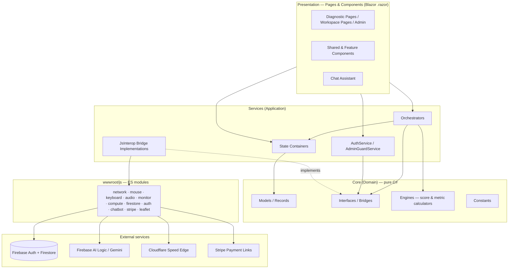

**Tech stack:** Blazor WASM (.NET 10) · C# · Firebase JS SDK 11.10 (Auth, Firestore, AI) · WebGL2 ·
Web Audio API · Web Workers · Pointer/Keyboard events · Cloudflare `speed.cloudflare.com` · Leaflet · Stripe
Payment Links · Mermaid (docs).

---

## 3. Actors

| Actor | Description |
|---|---|
| **Guest** | Unauthenticated visitor. Can run **all** client-side diagnostics, compile/export reports, browse the forum & knowledge base, chat with the AI assistant, and donate. |
| **Registered User** | A signed-in account (extends Guest). Can create/edit/delete own forum posts, comment, rate, submit support tickets, and reply to their own tickets. |
| **Admin** | Extends Registered User. Can moderate any post/comment, respond to and triage any ticket, and author/publish/delete knowledge-base articles. |
| **Firebase** (secondary) | Authentication + Firestore database. |
| **Gemini AI** (secondary) | LLM backing the assistant via Firebase AI Logic. |
| **Cloudflare** (secondary) | CORS-enabled edge endpoints for speed/latency measurement. |
| **Stripe** (secondary) | Hosted donation checkout via Payment Links. |

---

## 4. Functional Requirements (User Stories)

> Format: **As a** ⟨role⟩, **I want** ⟨capability⟩, **so that** ⟨benefit⟩. AC = acceptance criteria.

### Epic A — Authentication & Accounts
- **FR-A1** — As a **Guest**, I want to register with email/password (or Google), so that I can access
  community features.
  *AC:* a `users/{uid}` profile is created with `role = "user"`; duplicate/invalid emails are rejected with a
  friendly message.
- **FR-A2** — As a **Registered User**, I want to sign in and out, so that my identity is attached to my posts
  and tickets.
- **FR-A3** — As a **Registered User**, I want my session to persist across reloads, so that I'm not signed
  out unexpectedly.
- **FR-A4** — As an **Admin**, I want elevated access gated by my `role`, so that only I can reach admin tools.
  *AC:* non-admins visiting `/admin/*` see "Access denied".

### Epic B — Network Diagnostics
- **FR-B1** — As a **Guest**, I want to measure download, upload, ping, and jitter against Cloudflare's edge,
  so that I know my real connection speed.
  *AC:* live speed streams onto a gauge during the test; final values reflect a warm-up-excluded steady state.
- **FR-B2** — As a **Guest**, I want a clear description of the test server (Cloudflare anycast edge), so that
  I understand what my result represents.
- **FR-B3** — As a **Guest**, I want detailed connection info (IP, ISP, ASN, location, device, DoH), so that I
  can inspect my network environment.
- **FR-B4** — As a **Guest**, I want idle/loaded latency, jitter, packet loss, and a bufferbloat grade, so
  that I can judge connection stability.

### Epic C — Peripheral Diagnostics (Mouse · Keyboard · Audio)
- **FR-C1** — As a **Guest**, I want a mouse suite (CPS, Kohi, jitter/double-click, button registration,
  polling rate, DPI, jitter/dead-zone, accuracy, drag-and-drop), so that I can verify my mouse hardware.
  *AC:* DPI uses Pointer Lock for accurate counts; accuracy/drag use stage-relative coordinates; fast-click
  tests lock out for 2 s after finishing.
- **FR-C2** — As a **Guest**, I want a keyboard suite (key registration, chatter, key-rate, 60-second typing
  test with logical random text, NKRO rollover, ghosting, stuck-key, special-key), so that I can verify my
  keyboard.
- **FR-C3** — As a **Guest**, I want an audio suite (multi-channel playback, balance, mic loopback, echo &
  latency), so that I can verify my speakers and microphone.

### Epic D — Display Diagnostics (Monitor)
- **FR-D1** — As a **Guest**, I want fullscreen monitor test patterns (dead pixel, uniformity, gradients,
  contrast, sharpness, viewing angles, backlight bleed, ghosting, gamma, response time), so that I can assess
  panel quality.
- **FR-D2** — As a **Guest**, I want a live refresh-rate measurement (Hz, range, jitter, dropped frames,
  compliance), so that I can confirm my monitor runs at its rated rate.

### Epic E — Compute Benchmarks
- **FR-E1** — As a **Guest**, I want CPU (single + multi-threaded via Web Workers), GPU (Volume-Shader
  volumetric ray-marcher), and memory benchmarks with selectable presets, so that I can score my hardware.
- **FR-E2** — As a **Guest**, I want my scores compared against reference GPUs/CPUs, so that I have context.
  *AC:* GPU FPS is measured with a real GPU sync (`readPixels`); scores are normalized per preset so all modes
  report the same tier; references mirror UserBenchmark ordering.

### Epic F — Diagnostic Report
- **FR-F1** — As a **Guest**, I want to compile every diagnostic I ran this session into one report, so that I
  can review everything together.
- **FR-F2** — As a **Guest**, I want to export the report as Markdown, so that I can share or archive it.

### Epic G — Community Forum
- **FR-G1** — As a **Guest**, I want to browse, search, sort, and filter posts by tag, so that I can find
  relevant discussions.
- **FR-G2** — As a **Registered User**, I want to create posts (with markdown + tags), so that I can ask
  questions or share fixes.
- **FR-G3** — As a **Registered User**, I want to comment with threaded replies (up to depth 3) and rate posts
  (1–5 stars), so that I can participate.
- **FR-G4** — As a **Registered User**, I want to edit/delete my own posts and comments, so that I control my
  content. *AC:* Admins may delete any post/comment (moderation).
- **FR-G5** — As a **Guest**, I want feed cards to show accurate comment counts and average ratings, so that
  sorting by "Top rated"/"Most discussed" is meaningful.

### Epic H — Knowledge Base
- **FR-H1** — As a **Guest**, I want to search/sort/filter published articles by category and tag, with
  reading time and related articles, so that I can self-serve solutions.
- **FR-H2** — As a **Guest**, I want shareable article URLs (`/solutions/{id}`), so that I can bookmark/link.
- **FR-H3** — As an **Admin**, I want to create, edit, tag, categorize (including custom categories), preview,
  publish/unpublish, and delete articles, so that I can curate the knowledge base.

### Epic I — Support Tickets
- **FR-I1** — As a **Registered User**, I want to submit a ticket (subject + body), so that I can get help.
- **FR-I2** — As a **Registered User**, I want to view my tickets with status (Open / In Progress / Resolved),
  search, filter, and a response count, so that I can track them.
- **FR-I3** — As a **Registered User**, I want to read staff responses and **reply** to my active
  (non-resolved) tickets, so that we can hold a two-way conversation.
- **FR-I4** — As an **Admin**, I want a triage queue (status stats, search) and a detail panel to set status
  and post responses, so that I can resolve tickets. *AC:* a staff reply moves an Open ticket to In Progress.

### Epic J — Donations
- **FR-J1** — As a **Guest**, I want to donate via Stripe (one-time or monthly, preset or custom amount), so
  that I can support the project. *AC:* placeholder/unconfigured links never open a broken tab — a friendly
  "not set up yet" message with an appreciation note is shown instead.

### Epic K — AI Assistant
- **FR-K1** — As a **Guest**, I want to chat with a diagnostics assistant (Firebase AI / Gemini), so that I
  can get help interpreting results. *AC:* the assistant only answers hardware/network topics; replies render
  as markdown; errors degrade gracefully with no key required in the client.

### Epic L — Administration
- **FR-L1** — As an **Admin**, I want a console linking the tickets queue and KB editor, so that I have one
  moderation entry point.

---

## 5. Non-Functional Requirements (User Stories)

### Performance
- **NFR-P1** — As a **user**, I want the app to remain responsive while a benchmark runs, so that the tab
  never freezes. *AC:* heavy loops yield to the event loop (~16 ms); no single GPU frame risks a watchdog reset.
- **NFR-P2** — As a **user**, I want measurements to be accurate, so that results reflect reality. *AC:* speed
  excludes warm-up; GPU uses a real GPU sync; latency uses steady-state windows.

### Usability & Responsiveness
- **NFR-U1** — As a **mobile user**, I want every page to adapt to my screen, so that I can use the app on a
  phone. *AC:* the sidebar collapses into a slide-in drawer with a backdrop below 980 px.
- **NFR-U2** — As a **user**, I want clear, professional copy and consistent loading/empty/error states, so
  that the app feels polished and trustworthy.

### Reliability & Resilience
- **NFR-R1** — As a **user**, I want the app to fail fast with a clear message when the backend is
  unreachable, so that it never hangs. *AC:* Firestore ops time out at 12 s and show a retry card.
- **NFR-R2** — As a **user**, I want diagnostics to work even if the backend is down, so that the core value
  (local testing) is always available.

### Security & Privacy
- **NFR-S1** — As an **Admin**, I want server-side security rules (not just UI checks) to enforce access, so
  that data is protected. *AC:* Firestore rules enforce owner/admin permissions for every collection.
- **NFR-S2** — As a **user**, I want my card details handled only by Stripe and the AI to require no client
  key, so that no secrets live in the browser.
- **NFR-S3** — As a **user**, I want my location/IP gathered only for the network panel and never persisted,
  so that my privacy is respected.

### Portability & Maintainability
- **NFR-M1** — As a **developer**, I want browser APIs isolated behind `Core` interfaces, so that the domain
  stays testable and the backend is swappable (e.g. Firestore → SQL via repository adapters).
- **NFR-M2** — As a **developer**, I want the design to cascade from CSS design tokens + global classes, so
  that re-theming is centralized.

### Accessibility & Compatibility
- **NFR-A1** — As a **keyboard/screen user**, I want focusable controls, sensible contrast, and Esc-to-exit on
  fullscreen tests, so that the app is usable for everyone.
- **NFR-A2** — As a **user**, I want the app to run on any modern evergreen browser with WebGL2/Web Audio, so
  that I don't need special software.

---

## 6. UML Use Case Diagram

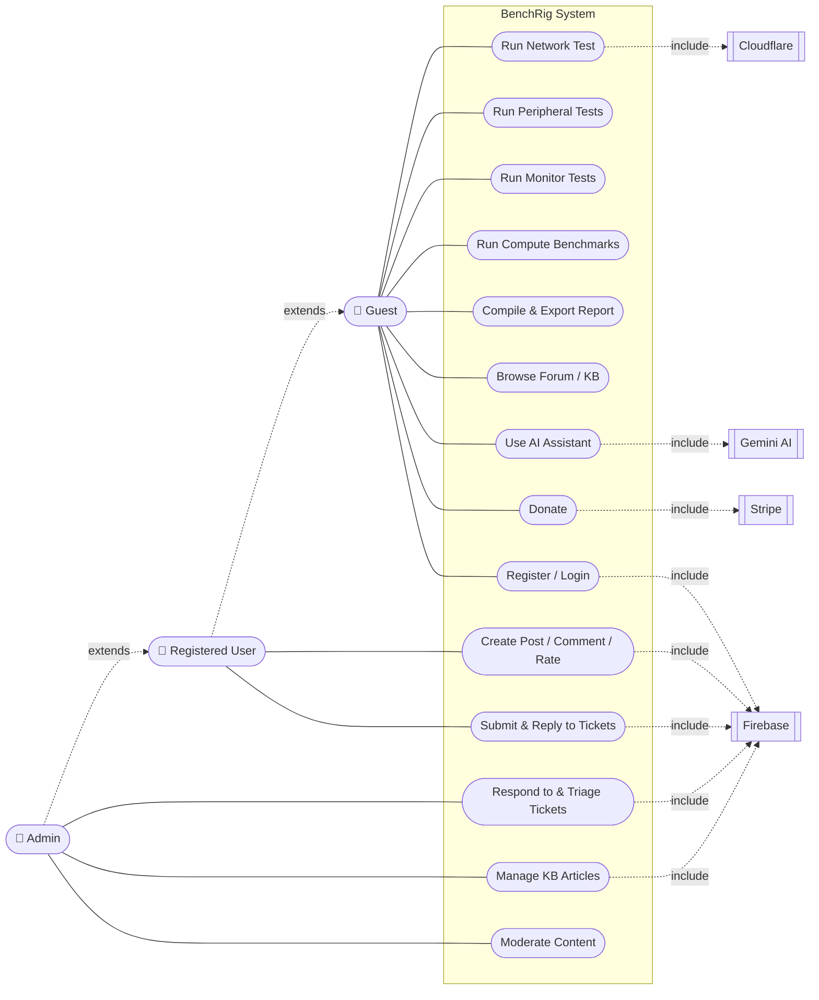

---

## 7. UML Domain Model

Conceptual entities and relationships (attributes only, no behaviour).

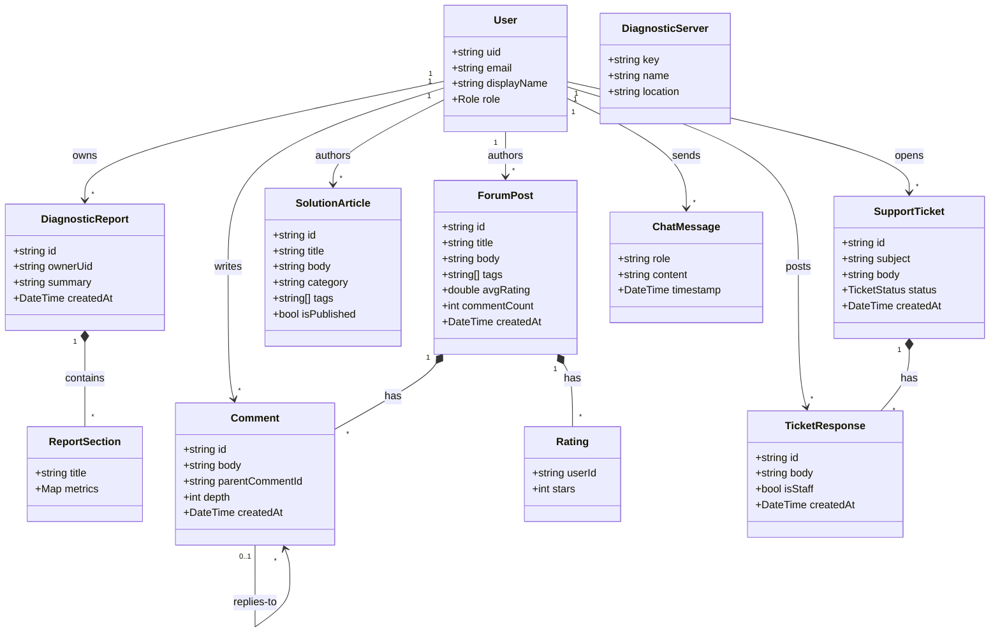

---

## 8. UML Class Diagram (Design Level)

Representative slice of the Clean-Architecture types (Network suite shown as the exemplar; the same pattern
repeats for Mouse/Keyboard/Audio/Monitor/Compute).

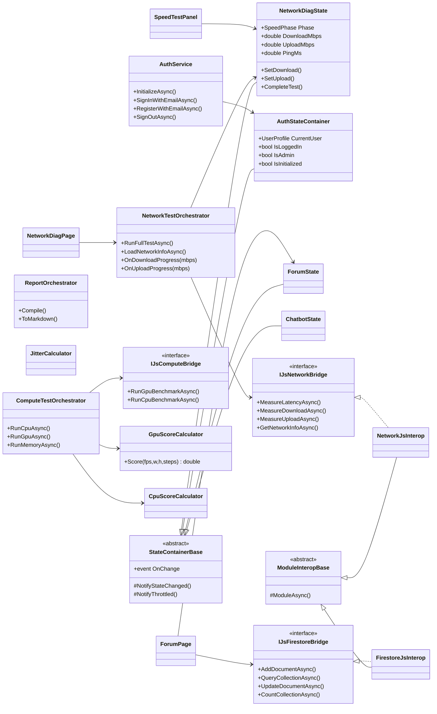

---

## 9. Entity-Relationship Diagram (Firestore data model)

Firestore is a document store; collections/subcollections are modeled here as entities. `PK` = document id,
`FK` = reference field. Subcollections are owned (identifying) relationships.

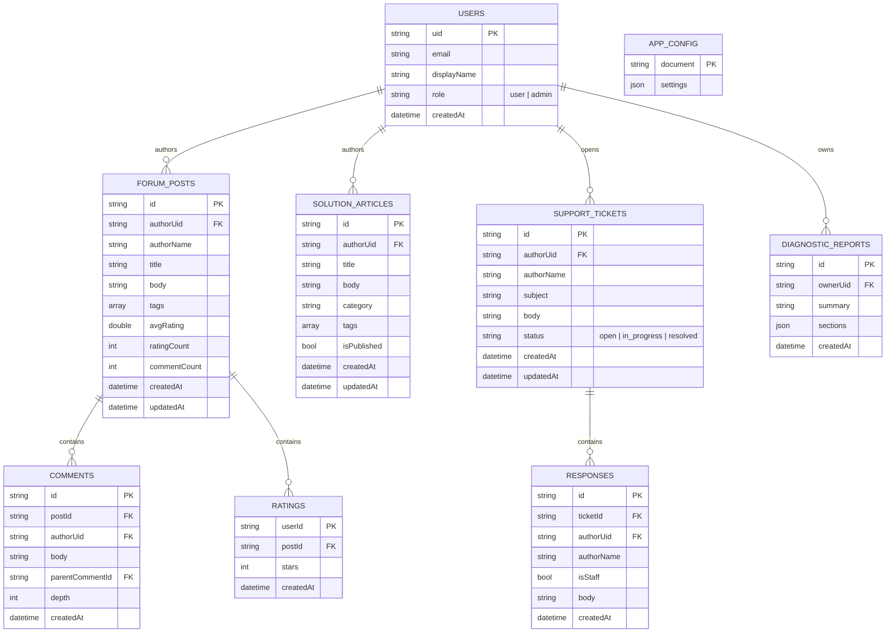

---

## 10. Sequence Diagrams

### 10.1 Run Network Speed Test
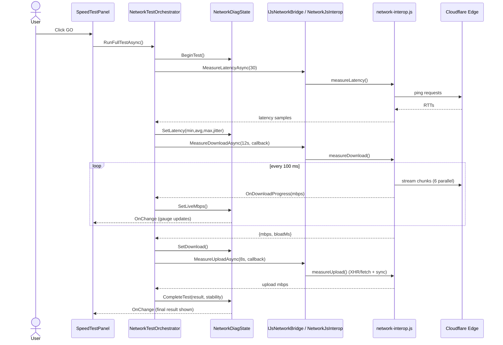

### 10.2 Run GPU Benchmark (Volume Shader)
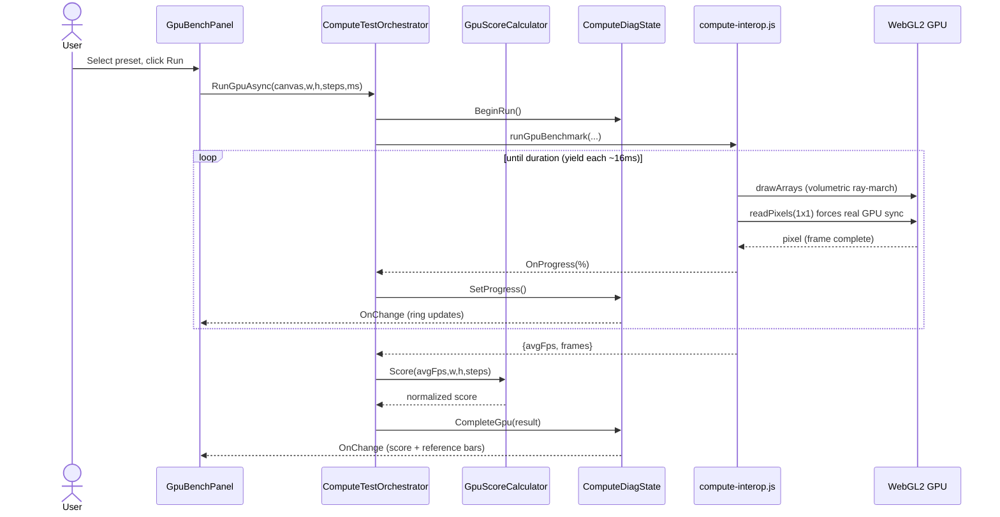

### 10.3 Post a Threaded Forum Reply
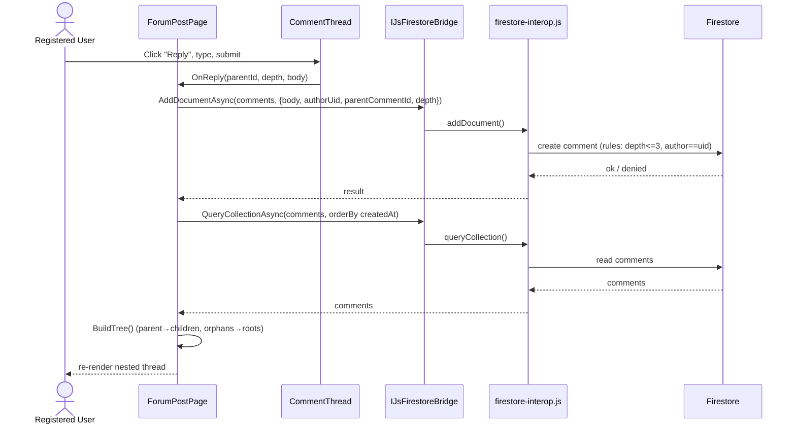

### 10.4 Support Ticket Lifecycle (User ⇄ Admin)
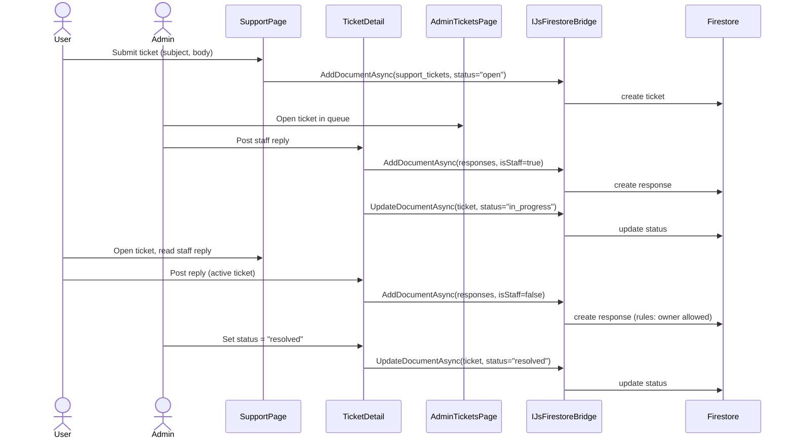

### 10.5 AI Assistant Message
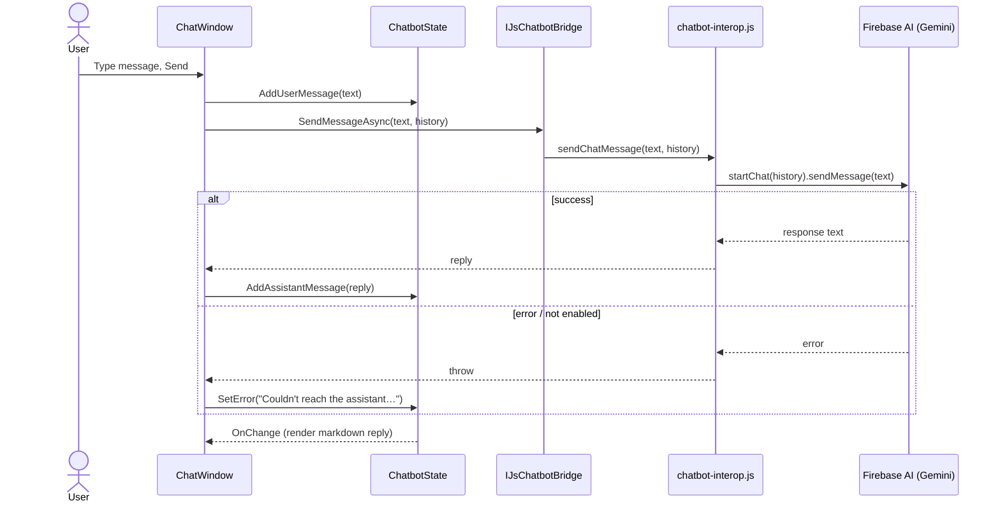

### 10.6 Register / Login
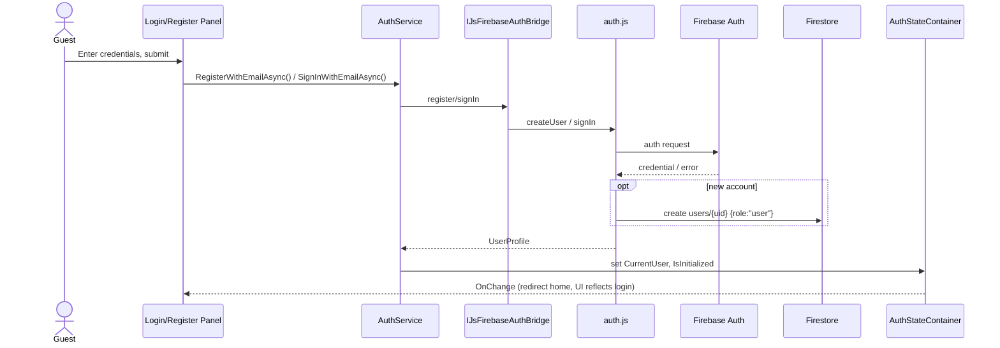

---

## 11. Traceability (requirements → diagrams)

| Requirement | Use Case | Sequence | Data |
|---|---|---|---|
| FR-A* | UC9 | §10.6 | USERS |
| FR-B* | UC1 | §10.1 | — (transient) |
| FR-C/D/E* | UC2/UC3/UC4 | §10.2 | — / DIAGNOSTIC_REPORTS |
| FR-F* | UC5 | §10.2 | DIAGNOSTIC_REPORTS |
| FR-G* | UC6/UC10/UC14 | §10.3 | FORUM_POSTS, COMMENTS, RATINGS |
| FR-H* | UC6/UC13 | — | SOLUTION_ARTICLES |
| FR-I* | UC11/UC12 | §10.4 | SUPPORT_TICKETS, RESPONSES |
| FR-J* | UC8 | — | — (Stripe) |
| FR-K* | UC7 | §10.5 | — (ephemeral) |

---

*End of design document.*
