# BenchRig — Software Design Document

> **Project:** BenchRig | Hardware & Network Diagnostic Platform
> **Stack:** Blazor WebAssembly (.NET 10) · Clean Architecture · Firebase Backend

---

## Table of Contents

1. [Introduction](#1-introduction)
2. [System Architecture](#2-system-architecture)
3. [Actors](#3-actors)
4. [Functional Requirements](#4-functional-requirements)
5. [Non-Functional Requirements](#5-non-functional-requirements)
6. [UML Use Case Diagram](#6-uml-use-case-diagram)
7. [UML Domain Model](#7-uml-domain-model)
8. [UML Class Diagram](#8-uml-class-diagram-design-level)
9. [Entity-Relationship Diagram](#9-entity-relationship-diagram)
10. [Sequence Diagrams](#10-sequence-diagrams)
11. [Requirements Traceability Matrix](#11-requirements-traceability-matrix)

---

## 1. Introduction

### 1.1 Purpose

**BenchRig** is a fully client-side web application for benchmarking and diagnosing all major hardware components of a personal computer — including network, mouse, keyboard, audio, monitor, and compute subsystems.

The application runs **directly in the browser** with no installations and no drivers required. Diagnostic results are compiled into a comprehensive, shareable report. A built-in community layer (forum, knowledge base, support tickets) and a conversational **AI assistant** powered by Gemini help users interpret results and troubleshoot hardware issues.

---

### 1.2 Scope

**In scope:**

- **Diagnostics (client-side):** Network speed & stability, Mouse suite (11 tests), Keyboard suite (8 tests), Audio suite (4 tests), Monitor suite (11 tests), Compute suite (CPU · GPU · Memory benchmarks)
- **Workspace features:** Diagnostic Report compiler, Community Forum, Knowledge Base, Support Tickets, Donations
- **Platform:** Secure Authentication (email/password & Google OAuth), role-based access control (User / Admin), conversational AI assistant

**Out of scope:**

- Native OS-level hardware sensors *(browser sandbox limitations)*
- Absolute or certified benchmark scoring
- Primary payment processing *(delegated to Stripe)*

---

### 1.3 Definitions

| Term | Definition |
| :--- | :--- |
| **Diagnostic suite** | A group of related tests targeting a specific hardware component (e.g., the Mouse suite). |
| **Orchestrator** | An application service that drives a multi-step diagnostic workflow and streams real-time metrics into state. |
| **Bridge** | A `Core` abstraction interface implemented by a JS-interop service to communicate with browser APIs. |
| **State container** | An in-memory, observable store that Blazor UI components subscribe to via `OnChange`. |
| **Report** | A compiled, downloadable summary of all diagnostics run during the current browser session. |

---

## 2. System Architecture

BenchRig is built on **Clean Architecture**. The `Core` layer is pure C# with zero browser dependencies. All browser and Web API access flows exclusively through abstract `Core` interfaces — called **bridges** — which are implemented in the `Services/JsInterop` layer.

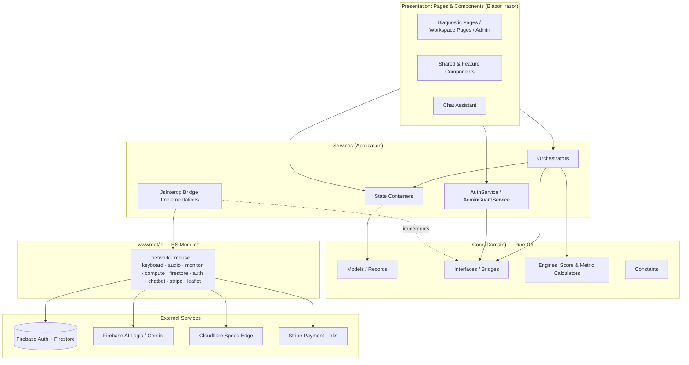
```mermaid
flowchart TB
    subgraph UI["Presentation: Pages & Components (Blazor .razor)"]
        P[Diagnostic Pages / Workspace Pages / Admin]
        C[Shared & Feature Components]
        CB[Chat Assistant]
    end

    subgraph SVC["Services (Application)"]
        ST[State Containers]
        OR[Orchestrators]
        AU[AuthService / AdminGuardService]
        JS[JsInterop Bridge Implementations]
    end

    subgraph CORE["Core (Domain) — Pure C#"]
        M[Models / Records]
        I[Interfaces / Bridges]
        E[Engines: Score & Metric Calculators]
        K[Constants]
    end

    subgraph JSW["wwwroot/js — ES Modules"]
        JM[network · mouse · keyboard · audio · monitor · compute · firestore · auth · chatbot · stripe · leaflet]
    end

    subgraph EXT["External Services"]
        FB[(Firebase Auth + Firestore)]
        AI[Firebase AI Logic / Gemini]
        CF[Cloudflare Speed Edge]
        SP[Stripe Payment Links]
    end

    UI --> ST
    UI --> OR
    UI --> AU
    OR --> I
    OR --> ST
    AU --> I
    JS -. implements .-> I
    JS --> JM
    OR --> E
    ST --> M
    JM --> FB
    JM --> AI
    JM --> CF
    JM --> SP
```

**Tech stack:**

| Layer | Technology |
| :--- | :--- |
| Frontend framework | Blazor WASM (.NET 10) · C# |
| Firebase services | JS SDK 11.10 — Auth, Firestore, AI Logic |
| Graphics / compute | WebGL2 · Web Workers · Web Audio API |
| Input capture | Pointer Events API · Keyboard Events API |
| Network testing | Cloudflare `speed.cloudflare.com` |
| Mapping | Leaflet.js |
| Payments | Stripe Payment Links |

---

## 3. Actors

| Actor | Role & Capabilities |
| :--- | :--- |
| **Guest** | Unauthenticated visitor. Can run all client-side diagnostics, compile and export reports, browse the forum and knowledge base, chat with the AI assistant, and donate. |
| **Registered User** | Extends **Guest**. Can create, edit, and delete own forum posts; comment; rate; submit support tickets; and reply to own tickets. |
| **Admin** | Extends **Registered User**. Can moderate any post or comment, respond to and triage any support ticket, and author, publish, or delete knowledge-base articles. |
| **Firebase** | Secondary system actor providing Authentication and Firestore database services. |
| **Gemini AI** | Secondary system actor providing the LLM backing the AI assistant via Firebase AI Logic. |
| **Cloudflare** | Secondary system actor providing CORS-enabled speed and latency measurement endpoints. |
| **Stripe** | Secondary system actor providing hosted donation checkout via Payment Links. |

> [!NOTE]
> Actor inheritance is additive. Every capability of the Guest is available to the Registered User, and every capability of the Registered User is available to the Admin.

---

## 4. Functional Requirements

> **Format:** `[ID]` (Component) — **Actor** performs *action* to achieve *goal*.
> `AC` = Acceptance Criteria.

---

### Epic A — Authentication & Accounts

**FR-A1** (Auth) — The **Guest** registers with email/password or Google to access community features.
*AC: A `users/{uid}` profile is created with `role = "user"`. Duplicate or invalid emails are rejected with a clear validation error.*

**FR-A2** (Auth) — The **Registered User** signs in and out to attach their identity to forum posts, comments, and support tickets.

**FR-A3** (Auth) — The **Registered User's** authentication session persists across page reloads to prevent unexpected sign-outs.

**FR-A4** (Auth) — The **Admin** obtains elevated access gated by a role field, ensuring only authorized administrators can reach admin tools.
*AC: Non-admins visiting `/admin/*` are shown an "Access denied" message.*

---

### Epic B — Network Diagnostics

**FR-B1** (Network) — The **Guest** measures download speed, upload speed, latency (ping), and jitter against Cloudflare's edge to determine actual connection speed.
*AC: Live measurements stream onto a visual gauge during the test. Final values reflect a warm-up-excluded steady state.*

**FR-B2** (Network) — The **Guest** views a clear description of the anycast edge test server to understand the geographic context of results.

**FR-B3** (Network) — The **Guest** inspects detailed connection properties: IP, ISP, ASN, location, device type, and DNS-over-HTTPS status.

**FR-B4** (Network) — The **Guest** measures idle/loaded latency, jitter, packet loss, and a bufferbloat grade to assess overall connection stability.

---

### Epic C — Peripheral Diagnostics

**FR-C1** (Peripherals) — The **Guest** runs the mouse suite: CPS, Kohi, double-click/jitter registration, button verification, polling rate, DPI estimation, dead-zone, target accuracy, and drag-and-drop.
*AC: DPI uses Pointer Lock for precise counts. Accuracy and drag-and-drop use relative canvas coordinates. Clicks lock out for 2 seconds upon completion.*

**FR-C2** (Peripherals) — The **Guest** runs the keyboard suite: key press registration, switch chatter detection, repeat rate, a 60-second typing speed test with randomized text, NKRO rollover, ghosting tests, stuck-key detection, and special key verification.

**FR-C3** (Peripherals) — The **Guest** runs the audio suite: multi-channel playback verification, stereo balance, microphone loopback capture, and echo/latency measurement.

---

### Epic D — Display Diagnostics

**FR-D1** (Display) — The **Guest** runs fullscreen monitor test patterns: dead pixel detection, backlight uniformity, color and grayscale gradients, contrast ratio, pixel sharpness, viewing angles, backlight bleed, screen ghosting, gamma correction, and response time.

**FR-D2** (Display) — The **Guest** monitors live refresh-rate measurements: Hz, frame jitter, dropped frames, and standard compliance.

---

### Epic E — Compute Benchmarks

**FR-E1** (Compute) — The **Guest** runs compute benchmarks: single/multi-threaded CPU passes via Web Workers, GPU volumetric ray-marching via WebGL2, and memory bandwidth allocation.

**FR-E2** (Compute) — The **Guest** compares benchmark scores against standard reference CPUs and GPUs to establish relative performance context.
*AC: GPU FPS is synchronized using WebGL `readPixels`. Scores normalize across presets. References reflect standard benchmark hierarchies.*

---

### Epic F — Diagnostic Report

**FR-F1** (Report) — The **Guest** compiles all diagnostic session results into a single, unified report summary.

**FR-F2** (Report) — The **Guest** exports the compiled diagnostic report in **Markdown format** for external sharing or archiving.

---

### Epic G — Community Forum

**FR-G1** (Forum) — The **Guest** browses, searches, sorts, and filters forum posts by category and tags.

**FR-G2** (Forum) — The **Registered User** creates discussion posts with Markdown formatting and tags.

**FR-G3** (Forum) — The **Registered User** posts comments with threaded replies (up to depth 3) and rates discussions on a 1–5 star scale.

**FR-G4** (Forum) — The **Registered User** edits or deletes their own posts and comments. The **Admin** retains moderator rights to remove any content.

**FR-G5** (Forum) — The **Guest** views discussion feeds showing comment counts and average ratings, enabling sorting by popularity or quality.

---

### Epic H — Knowledge Base

**FR-H1** (KB) — The **Guest** searches, sorts, and filters published knowledge base articles by category and tags, including reading times and related articles.

**FR-H2** (KB) — The **Guest** accesses KB articles via shareable direct URLs (`/solutions/{id}`).

**FR-H3** (KB) — The **Admin** manages KB articles: creates, edits, tags, categorizes, previews, publishes, and deletes.

---

### Epic I — Support Tickets

**FR-I1** (Support) — The **Registered User** submits support tickets with a subject and body.

**FR-I2** (Support) — The **Registered User** views their submitted tickets filtered by status (Open, In Progress, Resolved) with response counts.

**FR-I3** (Support) — The **Registered User** reads staff replies and responds to active, unresolved tickets.

**FR-I4** (Support) — The **Admin** triages support tickets through a dedicated queue: sets status and publishes responses.
*AC: A staff response automatically updates ticket status from Open → In Progress.*

---

### Epic J — Donations

**FR-J1** (Donations) — The **Guest** accesses one-time or monthly donation tiers via Stripe.
*AC: Unconfigured or placeholder links display an explanatory message rather than opening broken browser tabs.*

---

### Epic K — AI Assistant

**FR-K1** (AI) — The **Guest** interacts with a hardware and network diagnostics AI assistant powered by Firebase AI (Gemini).
*AC: Responses render in Markdown. Errors degrade gracefully. No client-side API keys are exposed in the browser.*

---

### Epic L — Administration

**FR-L1** (Admin) — The **Admin** accesses a unified administration console linking the tickets queue and the knowledge base editor.

---

## 5. Non-Functional Requirements

### 5.1 Performance

**NFR-P1** — The application remains responsive during heavy benchmarks by yielding execution loops to the browser event loop (~16 ms) to prevent tab freezing.
*AC: No single GPU frame risks a browser watchdog reset.*

**NFR-P2** — Metric calculations exclude warm-up latency and use synchronous WebGL operations to guarantee measurement accuracy.
*AC: Network measurements exclude initial warm-up windows. GPU uses real `readPixels` sync. Latency uses steady-state averaging.*

---

### 5.2 Usability & Responsiveness

**NFR-U1** — The UI adapts dynamically to all screen sizes, collapsing the sidebar into a slide-in drawer on screens narrower than **980 px**.

**NFR-U2** — Every view presents clear copy, consistent loading spinners, empty-state cues, and informative error messages.

---

### 5.3 Reliability & Resilience

**NFR-R1** — Network operations fail gracefully and display a retry option if Firestore is unreachable for more than **12 seconds**.
*AC: Firestore operations time out at 12 s and display a visual retry card.*

**NFR-R2** — All client-side diagnostics run locally without any backend connectivity, ensuring utility during offline states.

---

### 5.4 Security & Privacy

**NFR-S1** — Server-side Firestore security rules enforce strict owner/admin access permissions.
*AC: Rules restrict reads and writes based on UID and Admin role flags.*

**NFR-S2** — All financial payment handling is delegated entirely to Stripe. AI features require no exposed client-side API keys.

**NFR-S3** — IP addresses and location coordinates are processed transiently for diagnostic display only and are **never persisted** server-side.

---

### 5.5 Portability & Maintainability

**NFR-M1** — Browser and Web APIs are isolated behind abstract `Core` interfaces, enabling testability and allowing the backend engine to be swapped with minimal changes.

**NFR-M2** — The design system cascades from centralized CSS custom properties and utility classes, enabling global re-theming from a single source.

---

### 5.6 Accessibility & Compatibility

**NFR-A1** — All interactive components are keyboard-focusable, maintain accessible contrast ratios, and support `Esc` as a keyboard exit on all fullscreen tests.

**NFR-A2** — The application is compatible with all modern evergreen browsers that support WebGL2 and the Web Audio API, with no additional plugins required.

---

## 6. UML Use Case Diagram

The diagram below maps each actor to the use cases they may initiate. Dashed arrows denote actor inheritance (`extends`) and external system dependencies (`include`).

```mermaid
flowchart LR
    Guest(["👤 Guest"])
    User(["👤 Registered User"])
    Admin(["👤 Admin"])
    FB[["Firebase"]]
    AI[["Gemini AI"]]
    CF[["Cloudflare"]]
    SP[["Stripe"]]

    User -. extends .-> Guest
    Admin -. extends .-> User

    subgraph SYS["BenchRig System"]
        UC1(["Run Network Test"])
        UC2(["Run Peripheral Tests"])
        UC3(["Run Monitor Tests"])
        UC4(["Run Compute Benchmarks"])
        UC5(["Compile & Export Report"])
        UC6(["Browse Forum / KB"])
        UC7(["Use AI Assistant"])
        UC8(["Donate"])
        UC9(["Register / Login"])
        UC10(["Create Post / Comment / Rate"])
        UC11(["Submit & Reply to Tickets"])
        UC12(["Respond to & Triage Tickets"])
        UC13(["Manage KB Articles"])
        UC14(["Moderate Content"])
    end

    Guest --- UC1
    Guest --- UC2
    Guest --- UC3
    Guest --- UC4
    Guest --- UC5
    Guest --- UC6
    Guest --- UC7
    Guest --- UC8
    Guest --- UC9

    User --- UC10
    User --- UC11

    Admin --- UC12
    Admin --- UC13
    Admin --- UC14

    UC1 -. include .-> CF
    UC7 -. include .-> AI
    UC8 -. include .-> SP
    UC9 -. include .-> FB
    UC10 -. include .-> FB
    UC11 -. include .-> FB
    UC12 -. include .-> FB
    UC13 -. include .-> FB
```

---

## 7. UML Domain Model

Conceptual entities and their relationships, representing the application's persistent data shape.

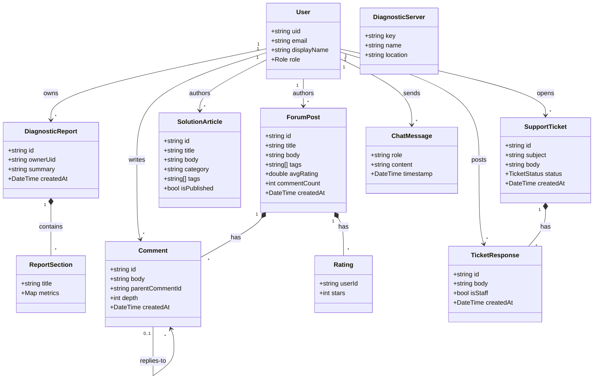
```mermaid
classDiagram
    class User {
        +string uid
        +string email
        +string displayName
        +Role role
    }
    class DiagnosticReport {
        +string id
        +string ownerUid
        +string summary
        +DateTime createdAt
    }
    class ReportSection {
        +string title
        +Map metrics
    }
    class ForumPost {
        +string id
        +string title
        +string body
        +string[] tags
        +double avgRating
        +int commentCount
        +DateTime createdAt
    }
    class Comment {
        +string id
        +string body
        +string parentCommentId
        +int depth
        +DateTime createdAt
    }
    class Rating {
        +string userId
        +int stars
    }
    class SolutionArticle {
        +string id
        +string title
        +string body
        +string category
        +string[] tags
        +bool isPublished
    }
    class SupportTicket {
        +string id
        +string subject
        +string body
        +TicketStatus status
        +DateTime createdAt
    }
    class TicketResponse {
        +string id
        +string body
        +bool isStaff
        +DateTime createdAt
    }
    class ChatMessage {
        +string role
        +string content
        +DateTime timestamp
    }
    class DiagnosticServer {
        +string key
        +string name
        +string location
    }

    User "1" --> "*" DiagnosticReport : owns
    User "1" --> "*" ForumPost : authors
    User "1" --> "*" Comment : writes
    User "1" --> "*" SupportTicket : opens
    User "1" --> "*" TicketResponse : posts
    User "1" --> "*" SolutionArticle : authors
    User "1" --> "*" ChatMessage : sends
    DiagnosticReport "1" *-- "*" ReportSection : contains
    ForumPost "1" *-- "*" Comment : has
    ForumPost "1" *-- "*" Rating : has
    Comment "0..1" --> "*" Comment : replies-to
    SupportTicket "1" *-- "*" TicketResponse : has
```

---

## 8. UML Class Diagram (Design Level)

A representative slice of the Clean Architecture design, using the Network diagnostic suite as the canonical example. The same pattern repeats for every other diagnostic suite.

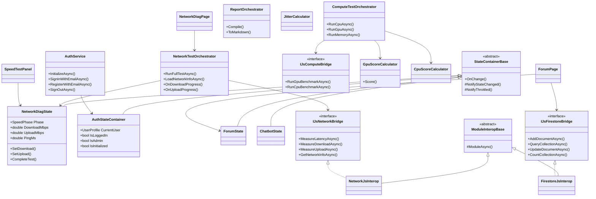
```mermaid
classDiagram
    class StateContainerBase {
        +OnChange()
        #NotifyStateChanged()
        #NotifyThrottled()
    }
    <<abstract>> StateContainerBase

    class NetworkDiagState {
        +SpeedPhase Phase
        +double DownloadMbps
        +double UploadMbps
        +double PingMs
        +SetDownload()
        +SetUpload()
        +CompleteTest()
    }
    class AuthStateContainer {
        +UserProfile CurrentUser
        +bool IsLoggedIn
        +bool IsAdmin
        +bool IsInitialized
    }
    class ForumState
    class ChatbotState

    class NetworkTestOrchestrator {
        +RunFullTestAsync()
        +LoadNetworkInfoAsync()
        +OnDownloadProgress()
        +OnUploadProgress()
    }
    class ComputeTestOrchestrator {
        +RunCpuAsync()
        +RunGpuAsync()
        +RunMemoryAsync()
    }
    class ReportOrchestrator {
        +Compile()
        +ToMarkdown()
    }
    class AuthService {
        +InitializeAsync()
        +SignInWithEmailAsync()
        +RegisterWithEmailAsync()
        +SignOutAsync()
    }

    class IJsNetworkBridge {
        +MeasureLatencyAsync()
        +MeasureDownloadAsync()
        +MeasureUploadAsync()
        +GetNetworkInfoAsync()
    }
    <<interface>> IJsNetworkBridge

    class IJsFirestoreBridge {
        +AddDocumentAsync()
        +QueryCollectionAsync()
        +UpdateDocumentAsync()
        +CountCollectionAsync()
    }
    <<interface>> IJsFirestoreBridge

    class IJsComputeBridge {
        +RunGpuBenchmarkAsync()
        +RunCpuBenchmarkAsync()
    }
    <<interface>> IJsComputeBridge

    class ModuleInteropBase {
        #ModuleAsync()
    }
    <<abstract>> ModuleInteropBase

    class NetworkJsInterop
    class FirestoreJsInterop
    class GpuScoreCalculator { +Score() }
    class CpuScoreCalculator
    class JitterCalculator
    class NetworkDiagPage
    class SpeedTestPanel
    class ForumPage

    StateContainerBase <|-- NetworkDiagState
    StateContainerBase <|-- AuthStateContainer
    StateContainerBase <|-- ForumState
    StateContainerBase <|-- ChatbotState

    ModuleInteropBase <|-- NetworkJsInterop
    ModuleInteropBase <|-- FirestoreJsInterop
    IJsNetworkBridge <|.. NetworkJsInterop
    IJsFirestoreBridge <|.. FirestoreJsInterop

    NetworkTestOrchestrator --> IJsNetworkBridge
    NetworkTestOrchestrator --> NetworkDiagState
    ComputeTestOrchestrator --> IJsComputeBridge
    ComputeTestOrchestrator --> GpuScoreCalculator
    ComputeTestOrchestrator --> CpuScoreCalculator
    AuthService --> AuthStateContainer
    NetworkDiagPage --> NetworkTestOrchestrator
    SpeedTestPanel --> NetworkDiagState
    ForumPage --> IJsFirestoreBridge
    ForumPage --> ForumState
```

---

## 9. Entity-Relationship Diagram

Firestore is a document store. Collections and subcollections are modeled here as entities. `PK` = document ID, `FK` = reference field.

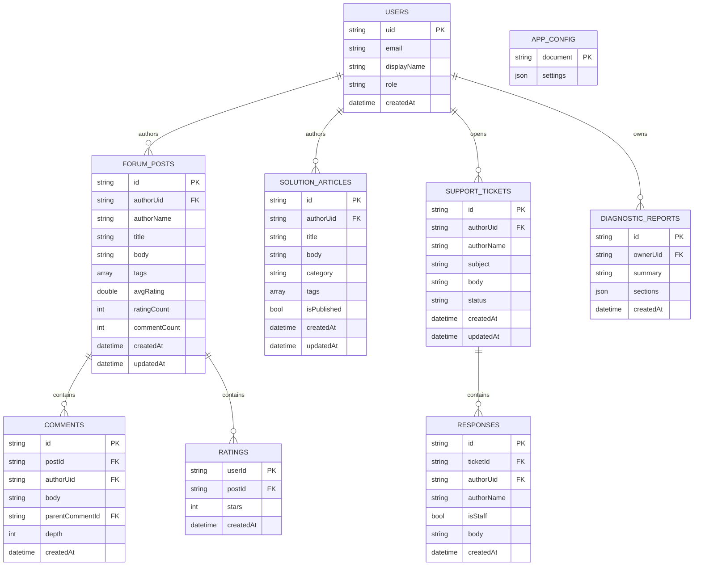
```mermaid
erDiagram
    USERS ||--o{ FORUM_POSTS : authors
    USERS ||--o{ SOLUTION_ARTICLES : authors
    USERS ||--o{ SUPPORT_TICKETS : opens
    USERS ||--o{ DIAGNOSTIC_REPORTS : owns
    FORUM_POSTS ||--o{ COMMENTS : contains
    FORUM_POSTS ||--o{ RATINGS : contains
    SUPPORT_TICKETS ||--o{ RESPONSES : contains

    USERS {
        string uid PK
        string email
        string displayName
        string role
        datetime createdAt
    }
    FORUM_POSTS {
        string id PK
        string authorUid FK
        string authorName
        string title
        string body
        array tags
        double avgRating
        int ratingCount
        int commentCount
        datetime createdAt
        datetime updatedAt
    }
    COMMENTS {
        string id PK
        string postId FK
        string authorUid FK
        string body
        string parentCommentId FK
        int depth
        datetime createdAt
    }
    RATINGS {
        string userId PK
        string postId FK
        int stars
        datetime createdAt
    }
    SOLUTION_ARTICLES {
        string id PK
        string authorUid FK
        string title
        string body
        string category
        array tags
        bool isPublished
        datetime createdAt
        datetime updatedAt
    }
    SUPPORT_TICKETS {
        string id PK
        string authorUid FK
        string authorName
        string subject
        string body
        string status
        datetime createdAt
        datetime updatedAt
    }
    RESPONSES {
        string id PK
        string ticketId FK
        string authorUid FK
        string authorName
        bool isStaff
        string body
        datetime createdAt
    }
    DIAGNOSTIC_REPORTS {
        string id PK
        string ownerUid FK
        string summary
        json sections
        datetime createdAt
    }
    APP_CONFIG {
        string document PK
        json settings
    }
```

---

## 10. Sequence Diagrams

Each diagram traces the full message flow for a key user interaction, from the UI through orchestrators, bridges, JS interop, and external services.

---

### 10.1 Run Network Speed Test

**Actors:** User, SpeedTestPanel, NetworkTestOrchestrator, NetworkDiagState, IJsNetworkBridge, `network-interop.js`, Cloudflare Edge

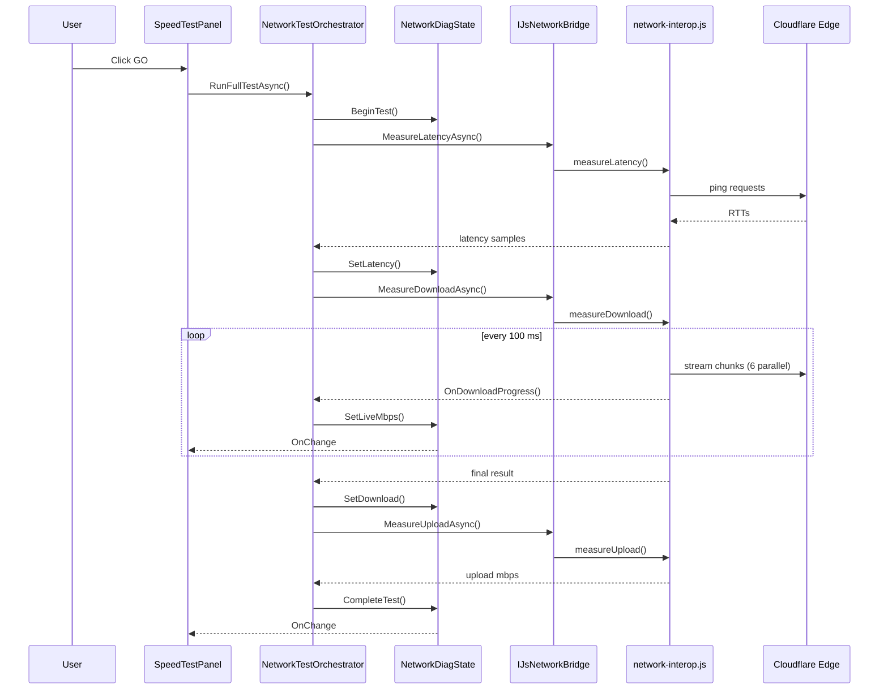
```mermaid
sequenceDiagram
    participant U as User
    participant Panel as SpeedTestPanel
    participant Orch as NetworkTestOrchestrator
    participant State as NetworkDiagState
    participant Bridge as IJsNetworkBridge
    participant JS as network-interop.js
    participant CF as Cloudflare Edge

    U->>Panel: Click GO
    Panel->>Orch: RunFullTestAsync()
    Orch->>State: BeginTest()
    Orch->>Bridge: MeasureLatencyAsync()
    Bridge->>JS: measureLatency()
    JS->>CF: ping requests
    CF-->>JS: RTTs
    JS-->>Orch: latency samples
    Orch->>State: SetLatency()
    Orch->>Bridge: MeasureDownloadAsync()
    Bridge->>JS: measureDownload()
    loop every 100 ms
        JS->>CF: stream chunks (6 parallel)
        JS-->>Orch: OnDownloadProgress()
        Orch->>State: SetLiveMbps()
        State-->>Panel: OnChange
    end
    JS-->>Orch: final result
    Orch->>State: SetDownload()
    Orch->>Bridge: MeasureUploadAsync()
    Bridge->>JS: measureUpload()
    JS-->>Orch: upload mbps
    Orch->>State: CompleteTest()
    State-->>Panel: OnChange
```

---

### 10.2 Run GPU Benchmark (Volume Shader)

**Actors:** User, GpuBenchPanel, ComputeTestOrchestrator, ComputeDiagState, IJsComputeBridge, `compute-interop.js`, WebGL2 GPU, GpuScoreCalculator

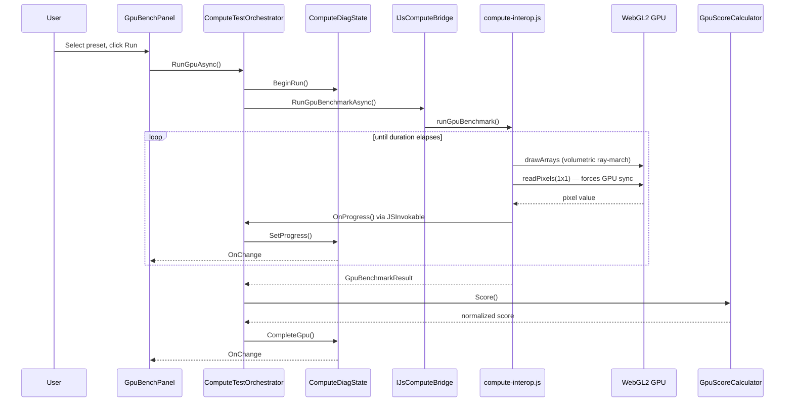
```mermaid
sequenceDiagram
    participant U as User
    participant Panel as GpuBenchPanel
    participant Orch as ComputeTestOrchestrator
    participant State as ComputeDiagState
    participant Bridge as IJsComputeBridge
    participant JS as compute-interop.js
    participant GPU as WebGL2 GPU
    participant Calc as GpuScoreCalculator

    U->>Panel: Select preset, click Run
    Panel->>Orch: RunGpuAsync()
    Orch->>State: BeginRun()
    Orch->>Bridge: RunGpuBenchmarkAsync()
    Bridge->>JS: runGpuBenchmark()
    loop until duration elapses
        JS->>GPU: drawArrays (volumetric ray-march)
        JS->>GPU: readPixels(1x1) — forces GPU sync
        GPU-->>JS: pixel value
        JS->>Orch: OnProgress() via JSInvokable
        Orch->>State: SetProgress()
        State-->>Panel: OnChange
    end
    JS-->>Orch: GpuBenchmarkResult
    Orch->>Calc: Score()
    Calc-->>Orch: normalized score
    Orch->>State: CompleteGpu()
    State-->>Panel: OnChange
```

---

### 10.3 Post a Threaded Forum Reply

**Actors:** Registered User, ForumPostPage, CommentThread, IJsFirestoreBridge, `firestore-interop.js`, Firestore

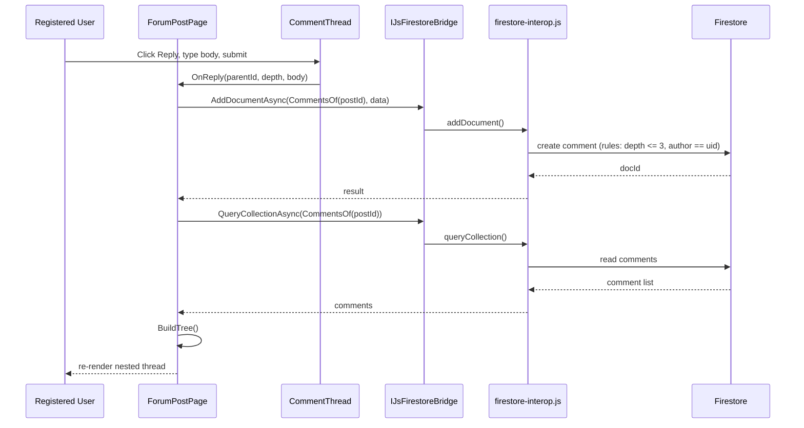
```mermaid
sequenceDiagram
    participant U as Registered User
    participant Page as ForumPostPage
    participant Thread as CommentThread
    participant FS as IJsFirestoreBridge
    participant JS as firestore-interop.js
    participant DB as Firestore

    U->>Thread: Click Reply, type body, submit
    Thread->>Page: OnReply(parentId, depth, body)
    Page->>FS: AddDocumentAsync(CommentsOf(postId), data)
    FS->>JS: addDocument()
    JS->>DB: create comment (rules: depth <= 3, author == uid)
    DB-->>JS: docId
    JS-->>Page: result
    Page->>FS: QueryCollectionAsync(CommentsOf(postId))
    FS->>JS: queryCollection()
    JS->>DB: read comments
    DB-->>JS: comment list
    JS-->>Page: comments
    Page->>Page: BuildTree()
    Page-->>U: re-render nested thread
```

---

### 10.4 Support Ticket Lifecycle (User ↔ Admin)

**Actors:** User, Admin, SupportPage, TicketDetail, AdminTicketsPage, IJsFirestoreBridge, `firestore-interop.js`, Firestore

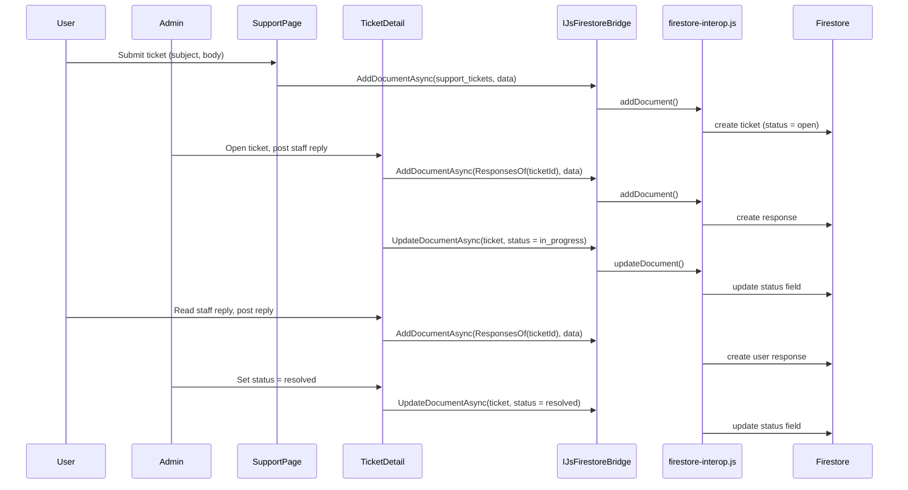
```mermaid
sequenceDiagram
    participant U as User
    participant A as Admin
    participant SP as SupportPage
    participant TD as TicketDetail
    participant FS as IJsFirestoreBridge
    participant JS as firestore-interop.js
    participant DB as Firestore

    U->>SP: Submit ticket (subject, body)
    SP->>FS: AddDocumentAsync(support_tickets, data)
    FS->>JS: addDocument()
    JS->>DB: create ticket (status = open)
    A->>TD: Open ticket, post staff reply
    TD->>FS: AddDocumentAsync(ResponsesOf(ticketId), data)
    FS->>JS: addDocument()
    JS->>DB: create response
    TD->>FS: UpdateDocumentAsync(ticket, status = in_progress)
    FS->>JS: updateDocument()
    JS->>DB: update status field
    U->>TD: Read staff reply, post reply
    TD->>FS: AddDocumentAsync(ResponsesOf(ticketId), data)
    JS->>DB: create user response
    A->>TD: Set status = resolved
    TD->>FS: UpdateDocumentAsync(ticket, status = resolved)
    JS->>DB: update status field
```

---

### 10.5 AI Assistant Message

**Actors:** User, ChatWindow, ChatbotState, IJsChatbotBridge, `chatbot-interop.js`, Firebase AI (Gemini)

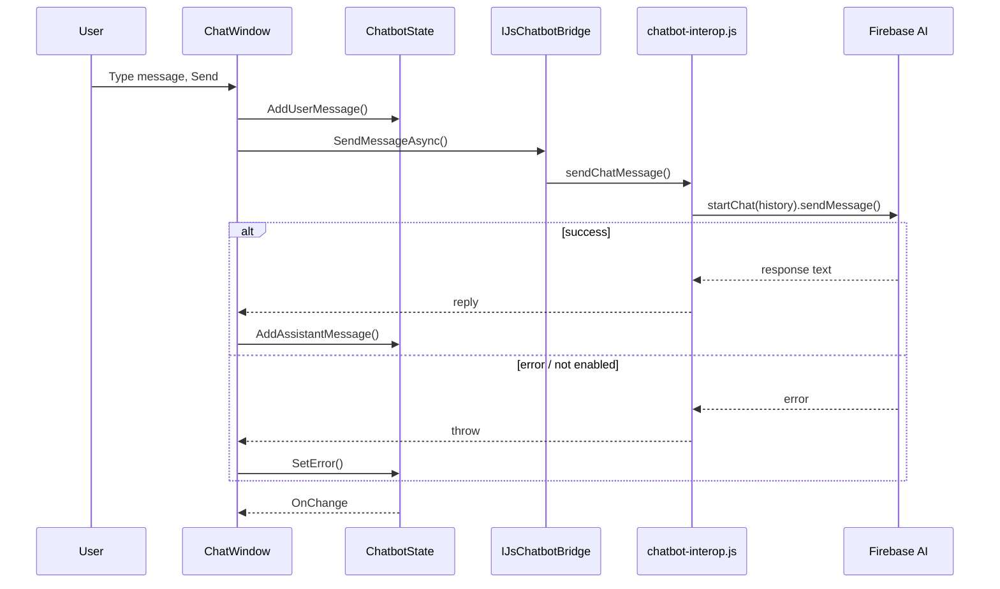
```mermaid
sequenceDiagram
    participant U as User
    participant CW as ChatWindow
    participant State as ChatbotState
    participant Bridge as IJsChatbotBridge
    participant JS as chatbot-interop.js
    participant AI as Firebase AI

    U->>CW: Type message, Send
    CW->>State: AddUserMessage()
    CW->>Bridge: SendMessageAsync()
    Bridge->>JS: sendChatMessage()
    JS->>AI: startChat(history).sendMessage()
    alt success
        AI-->>JS: response text
        JS-->>CW: reply
        CW->>State: AddAssistantMessage()
    else error / not enabled
        AI-->>JS: error
        JS-->>CW: throw
        CW->>State: SetError()
    end
    State-->>CW: OnChange
```

---

### 10.6 Register / Login

**Actors:** Guest, Login/Register Panel, AuthService, IJsFirebaseAuthBridge, `auth.js`, Firebase Auth, Firestore, AuthStateContainer

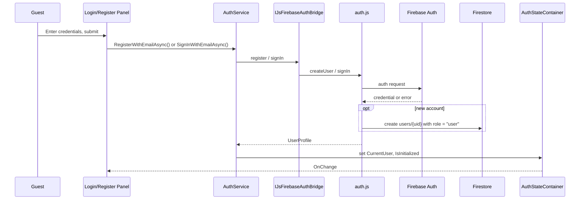
```mermaid
sequenceDiagram
    participant G as Guest
    participant Panel as Login/Register Panel
    participant Svc as AuthService
    participant Bridge as IJsFirebaseAuthBridge
    participant JS as auth.js
    participant FB as Firebase Auth
    participant DB as Firestore
    participant State as AuthStateContainer

    G->>Panel: Enter credentials, submit
    Panel->>Svc: RegisterWithEmailAsync() or SignInWithEmailAsync()
    Svc->>Bridge: register / signIn
    Bridge->>JS: createUser / signIn
    JS->>FB: auth request
    FB-->>JS: credential or error
    opt new account
        JS->>DB: create users/{uid} with role = "user"
    end
    JS-->>Svc: UserProfile
    Svc->>State: set CurrentUser, IsInitialized
    State-->>Panel: OnChange
```

---

### 10.7 Run Mouse Diagnostics

**Actors:** User, MouseDiagPage, MouseTestOrchestrator, MouseDiagState, IJsMouseBridge, `mouse-interop.js`, Browser Pointer APIs

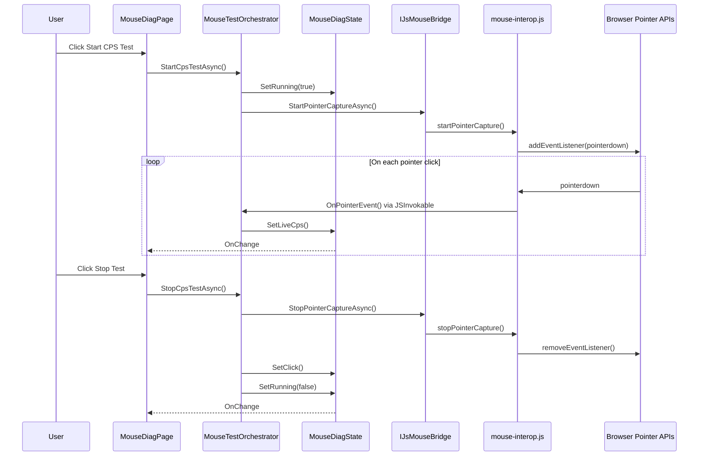
```mermaid
sequenceDiagram
    participant U as User
    participant Page as MouseDiagPage
    participant Orch as MouseTestOrchestrator
    participant State as MouseDiagState
    participant Bridge as IJsMouseBridge
    participant JS as mouse-interop.js
    participant Browser as Browser Pointer APIs

    U->>Page: Click Start CPS Test
    Page->>Orch: StartCpsTestAsync()
    Orch->>State: SetRunning(true)
    Orch->>Bridge: StartPointerCaptureAsync()
    Bridge->>JS: startPointerCapture()
    JS->>Browser: addEventListener(pointerdown)
    loop On each pointer click
        Browser->>JS: pointerdown
        JS->>Orch: OnPointerEvent() via JSInvokable
        Orch->>State: SetLiveCps()
        State-->>Page: OnChange
    end
    U->>Page: Click Stop Test
    Page->>Orch: StopCpsTestAsync()
    Orch->>Bridge: StopPointerCaptureAsync()
    Bridge->>JS: stopPointerCapture()
    JS->>Browser: removeEventListener()
    Orch->>State: SetClick()
    Orch->>State: SetRunning(false)
    State-->>Page: OnChange
```

---

### 10.8 Run Keyboard Diagnostics

**Actors:** User, KeyboardDiagPage, KeyboardTestOrchestrator, KeyboardDiagState, IJsKeyboardBridge, `keyboard-interop.js`, Browser Keyboard APIs

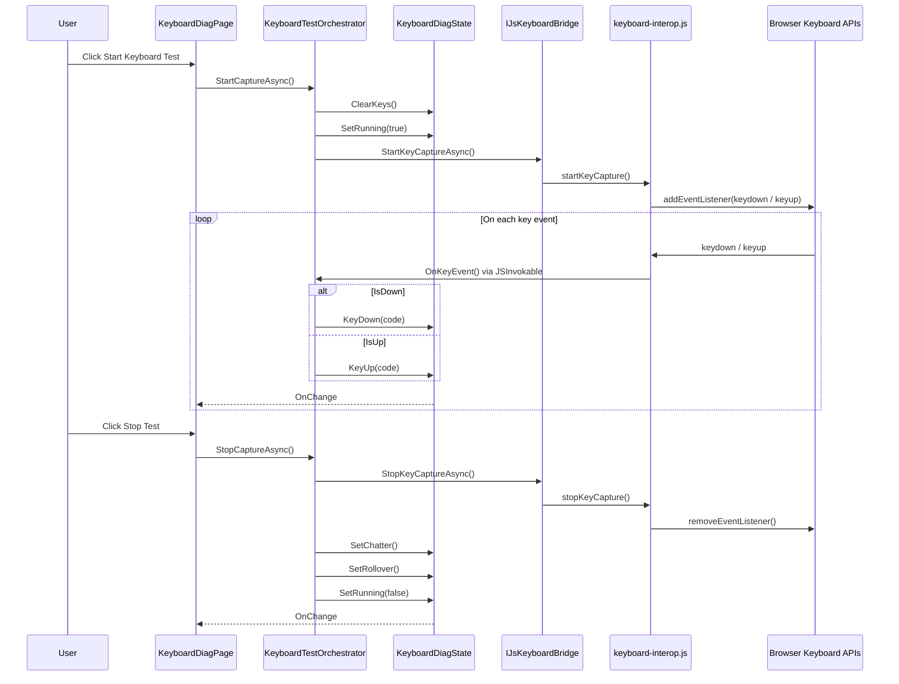
```mermaid
sequenceDiagram
    participant U as User
    participant Page as KeyboardDiagPage
    participant Orch as KeyboardTestOrchestrator
    participant State as KeyboardDiagState
    participant Bridge as IJsKeyboardBridge
    participant JS as keyboard-interop.js
    participant Browser as Browser Keyboard APIs

    U->>Page: Click Start Keyboard Test
    Page->>Orch: StartCaptureAsync()
    Orch->>State: ClearKeys()
    Orch->>State: SetRunning(true)
    Orch->>Bridge: StartKeyCaptureAsync()
    Bridge->>JS: startKeyCapture()
    JS->>Browser: addEventListener(keydown / keyup)
    loop On each key event
        Browser->>JS: keydown / keyup
        JS->>Orch: OnKeyEvent() via JSInvokable
        alt IsDown
            Orch->>State: KeyDown(code)
        else IsUp
            Orch->>State: KeyUp(code)
        end
        State-->>Page: OnChange
    end
    U->>Page: Click Stop Test
    Page->>Orch: StopCaptureAsync()
    Orch->>Bridge: StopKeyCaptureAsync()
    Bridge->>JS: stopKeyCapture()
    JS->>Browser: removeEventListener()
    Orch->>State: SetChatter()
    Orch->>State: SetRollover()
    Orch->>State: SetRunning(false)
    State-->>Page: OnChange
```

---

### 10.9 Run Audio Diagnostics

**Actors:** User, AudioDiagPage, AudioTestOrchestrator, AudioDiagState, IJsAudioBridge, `audio-interop.js`, Web Audio API

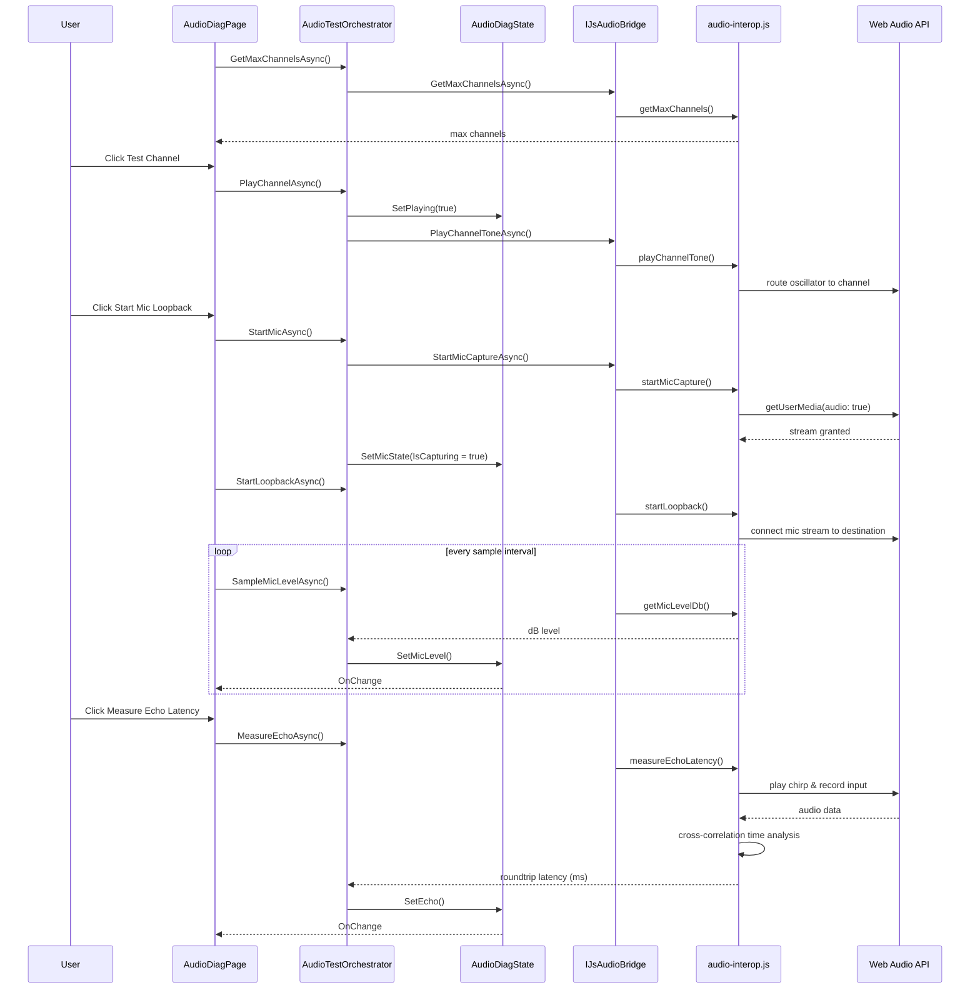
```mermaid
sequenceDiagram
    participant U as User
    participant Page as AudioDiagPage
    participant Orch as AudioTestOrchestrator
    participant State as AudioDiagState
    participant Bridge as IJsAudioBridge
    participant JS as audio-interop.js
    participant Browser as Web Audio API

    Page->>Orch: GetMaxChannelsAsync()
    Orch->>Bridge: GetMaxChannelsAsync()
    Bridge->>JS: getMaxChannels()
    JS-->>Page: max channels
    U->>Page: Click Test Channel
    Page->>Orch: PlayChannelAsync()
    Orch->>State: SetPlaying(true)
    Orch->>Bridge: PlayChannelToneAsync()
    Bridge->>JS: playChannelTone()
    JS->>Browser: route oscillator to channel
    U->>Page: Click Start Mic Loopback
    Page->>Orch: StartMicAsync()
    Orch->>Bridge: StartMicCaptureAsync()
    Bridge->>JS: startMicCapture()
    JS->>Browser: getUserMedia(audio: true)
    Browser-->>JS: stream granted
    Orch->>State: SetMicState(IsCapturing = true)
    Page->>Orch: StartLoopbackAsync()
    Bridge->>JS: startLoopback()
    JS->>Browser: connect mic stream to destination
    loop every sample interval
        Page->>Orch: SampleMicLevelAsync()
        Bridge->>JS: getMicLevelDb()
        JS-->>Orch: dB level
        Orch->>State: SetMicLevel()
        State-->>Page: OnChange
    end
    U->>Page: Click Measure Echo Latency
    Page->>Orch: MeasureEchoAsync()
    Bridge->>JS: measureEchoLatency()
    JS->>Browser: play chirp & record input
    Browser-->>JS: audio data
    JS->>JS: cross-correlation time analysis
    JS-->>Orch: roundtrip latency (ms)
    Orch->>State: SetEcho()
    State-->>Page: OnChange
```

---

### 10.10 Run Monitor Diagnostics

**Actors:** User, MonitorDiagPage, MonitorTestOrchestrator, MonitorDiagState, IJsMonitorBridge, `monitor-interop.js`, requestAnimationFrame

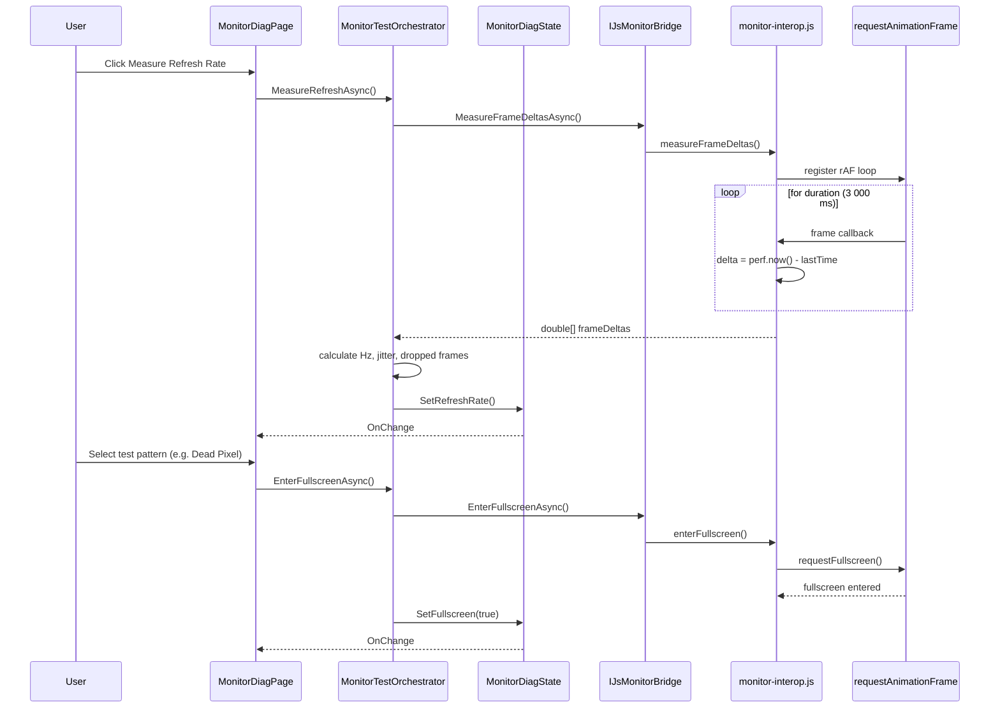
```mermaid
sequenceDiagram
    participant U as User
    participant Page as MonitorDiagPage
    participant Orch as MonitorTestOrchestrator
    participant State as MonitorDiagState
    participant Bridge as IJsMonitorBridge
    participant JS as monitor-interop.js
    participant Browser as requestAnimationFrame

    U->>Page: Click Measure Refresh Rate
    Page->>Orch: MeasureRefreshAsync()
    Orch->>Bridge: MeasureFrameDeltasAsync()
    Bridge->>JS: measureFrameDeltas()
    JS->>Browser: register rAF loop
    loop for duration (3 000 ms)
        Browser->>JS: frame callback
        JS->>JS: delta = perf.now() - lastTime
    end
    JS-->>Orch: double[] frameDeltas
    Orch->>Orch: calculate Hz, jitter, dropped frames
    Orch->>State: SetRefreshRate()
    State-->>Page: OnChange
    U->>Page: Select test pattern (e.g. Dead Pixel)
    Page->>Orch: EnterFullscreenAsync()
    Orch->>Bridge: EnterFullscreenAsync()
    Bridge->>JS: enterFullscreen()
    JS->>Browser: requestFullscreen()
    Browser-->>JS: fullscreen entered
    Orch->>State: SetFullscreen(true)
    State-->>Page: OnChange
```

---

### 10.11 Run CPU & Memory Benchmarks

**Actors:** User, ComputeBenchPage, ComputeTestOrchestrator, ComputeDiagState, IJsComputeBridge, `compute-interop.js`, Web Workers

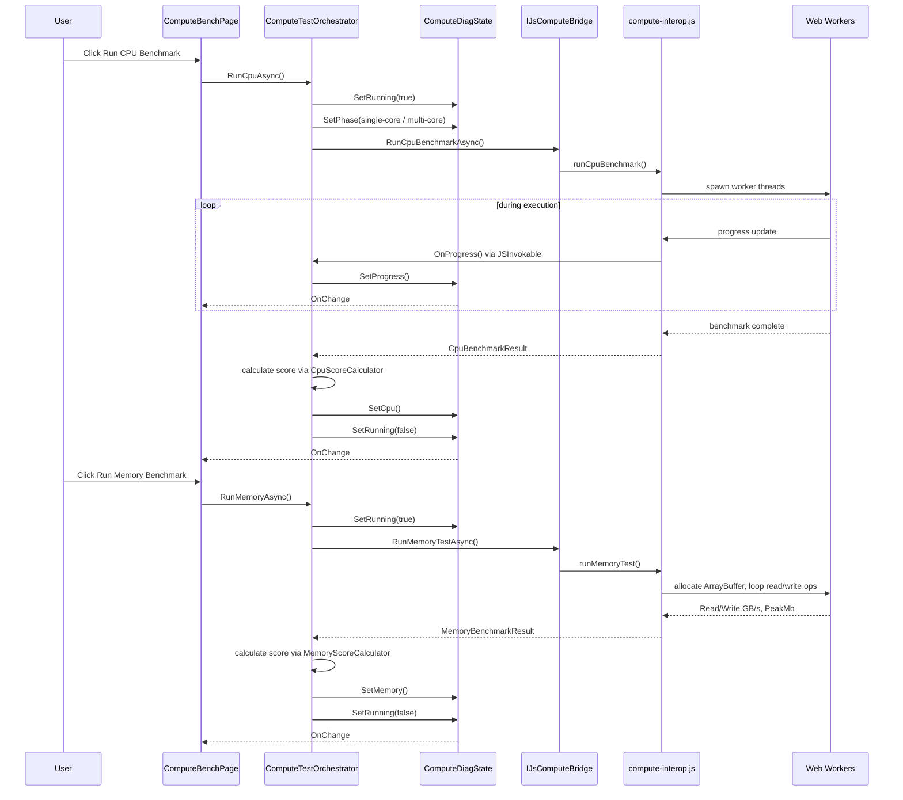
```mermaid
sequenceDiagram
    participant U as User
    participant Page as ComputeBenchPage
    participant Orch as ComputeTestOrchestrator
    participant State as ComputeDiagState
    participant Bridge as IJsComputeBridge
    participant JS as compute-interop.js
    participant Workers as Web Workers

    U->>Page: Click Run CPU Benchmark
    Page->>Orch: RunCpuAsync()
    Orch->>State: SetRunning(true)
    Orch->>State: SetPhase(single-core / multi-core)
    Orch->>Bridge: RunCpuBenchmarkAsync()
    Bridge->>JS: runCpuBenchmark()
    JS->>Workers: spawn worker threads
    loop during execution
        Workers->>JS: progress update
        JS->>Orch: OnProgress() via JSInvokable
        Orch->>State: SetProgress()
        State-->>Page: OnChange
    end
    Workers-->>JS: benchmark complete
    JS-->>Orch: CpuBenchmarkResult
    Orch->>Orch: calculate score via CpuScoreCalculator
    Orch->>State: SetCpu()
    Orch->>State: SetRunning(false)
    State-->>Page: OnChange

    U->>Page: Click Run Memory Benchmark
    Page->>Orch: RunMemoryAsync()
    Orch->>State: SetRunning(true)
    Orch->>Bridge: RunMemoryTestAsync()
    Bridge->>JS: runMemoryTest()
    JS->>Workers: allocate ArrayBuffer, loop read/write ops
    Workers-->>JS: Read/Write GB/s, PeakMb
    JS-->>Orch: MemoryBenchmarkResult
    Orch->>Orch: calculate score via MemoryScoreCalculator
    Orch->>State: SetMemory()
    Orch->>State: SetRunning(false)
    State-->>Page: OnChange
```

---

### 10.12 Compile & Export Diagnostic Report

**Actors:** User, ReportPage, ReportOrchestrator, ReportBuilder, ReportState, JS download helper

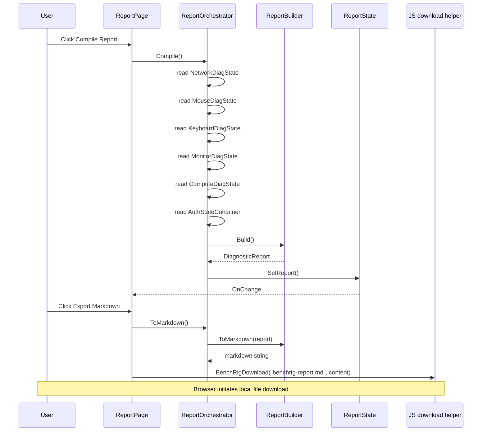
```mermaid
sequenceDiagram
    participant U as User
    participant Page as ReportPage
    participant Orch as ReportOrchestrator
    participant Builder as ReportBuilder
    participant State as ReportState
    participant JS as JS download helper

    U->>Page: Click Compile Report
    Page->>Orch: Compile()
    Orch->>Orch: read NetworkDiagState
    Orch->>Orch: read MouseDiagState
    Orch->>Orch: read KeyboardDiagState
    Orch->>Orch: read MonitorDiagState
    Orch->>Orch: read ComputeDiagState
    Orch->>Orch: read AuthStateContainer
    Orch->>Builder: Build()
    Builder-->>Orch: DiagnosticReport
    Orch->>State: SetReport()
    State-->>Page: OnChange

    U->>Page: Click Export Markdown
    Page->>Orch: ToMarkdown()
    Orch->>Builder: ToMarkdown(report)
    Builder-->>Orch: markdown string
    Page->>JS: BenchRigDownload("benchrig-report.md", content)
    Note over U, JS: Browser initiates local file download
```

---

### 10.13 Manage Knowledge Base Articles (Admin)

**Actors:** Admin, AdminSolutionsPage, AuthStateContainer, IJsFirestoreBridge, `firestore-interop.js`, Firestore

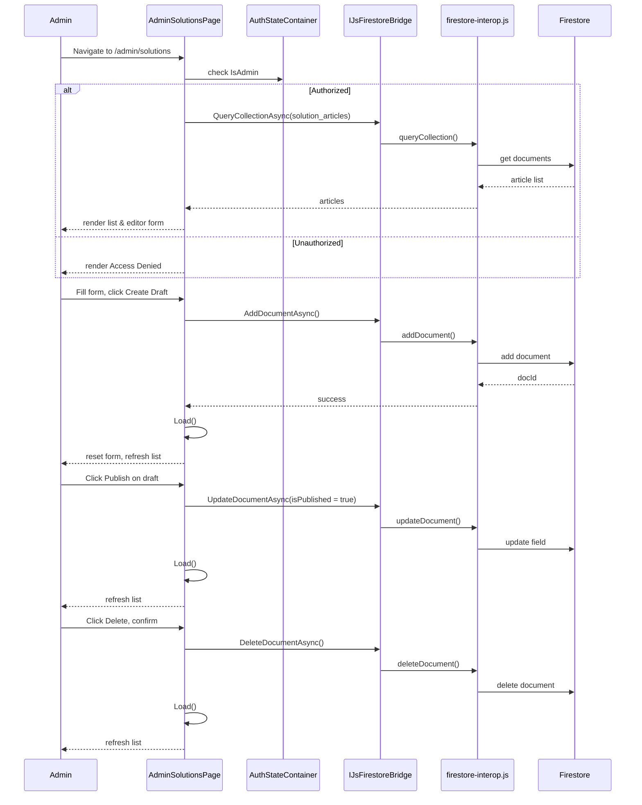
```mermaid
sequenceDiagram
    participant A as Admin
    participant Page as AdminSolutionsPage
    participant Auth as AuthStateContainer
    participant FS as IJsFirestoreBridge
    participant JS as firestore-interop.js
    participant DB as Firestore

    A->>Page: Navigate to /admin/solutions
    Page->>Auth: check IsAdmin
    alt Authorized
        Page->>FS: QueryCollectionAsync(solution_articles)
        FS->>JS: queryCollection()
        JS->>DB: get documents
        DB-->>JS: article list
        JS-->>Page: articles
        Page-->>A: render list & editor form
    else Unauthorized
        Page-->>A: render Access Denied
    end

    A->>Page: Fill form, click Create Draft
    Page->>FS: AddDocumentAsync()
    FS->>JS: addDocument()
    JS->>DB: add document
    DB-->>JS: docId
    JS-->>Page: success
    Page->>Page: Load()
    Page-->>A: reset form, refresh list

    A->>Page: Click Publish on draft
    Page->>FS: UpdateDocumentAsync(isPublished = true)
    FS->>JS: updateDocument()
    JS->>DB: update field
    Page->>Page: Load()
    Page-->>A: refresh list

    A->>Page: Click Delete, confirm
    Page->>FS: DeleteDocumentAsync()
    FS->>JS: deleteDocument()
    JS->>DB: delete document
    Page->>Page: Load()
    Page-->>A: refresh list
```

---

### 10.14 Donate via Stripe

**Actors:** User, DonateButton, IJsStripeBridge, `stripe-interop.js`, Stripe API

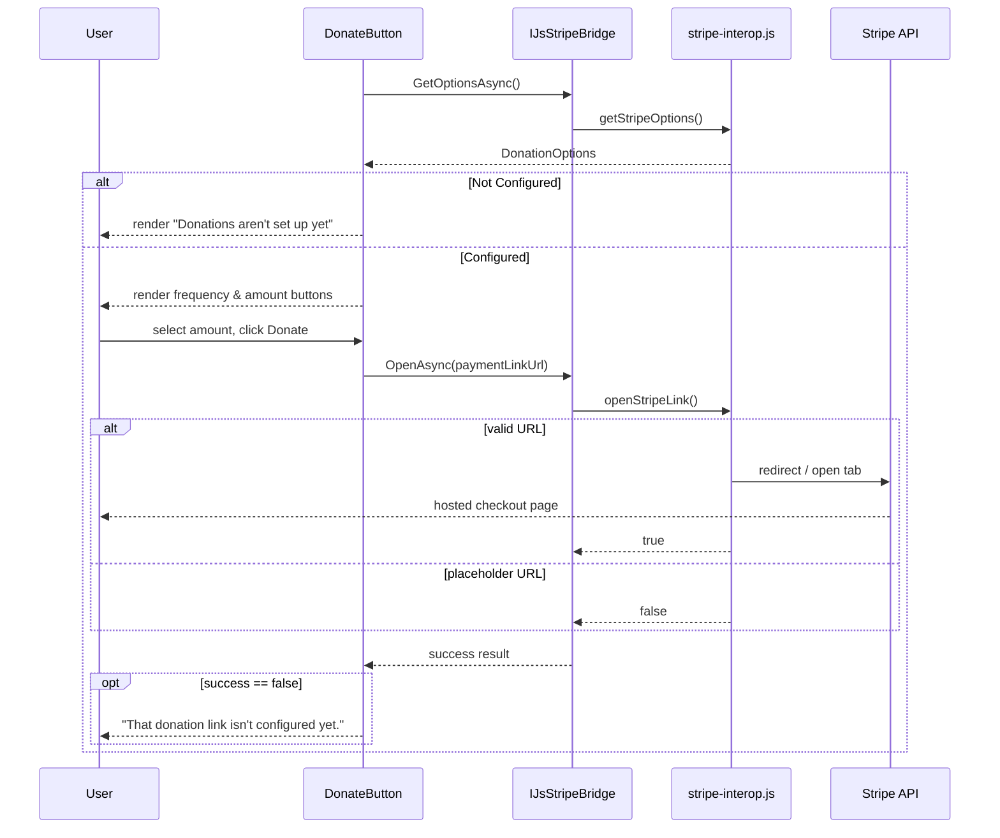
```mermaid
sequenceDiagram
    participant U as User
    participant Page as DonateButton
    participant Bridge as IJsStripeBridge
    participant JS as stripe-interop.js
    participant Stripe as Stripe API

    Page->>Bridge: GetOptionsAsync()
    Bridge->>JS: getStripeOptions()
    JS-->>Page: DonationOptions
    alt Not Configured
        Page-->>U: render "Donations aren't set up yet"
    else Configured
        Page-->>U: render frequency & amount buttons
        U->>Page: select amount, click Donate
        Page->>Bridge: OpenAsync(paymentLinkUrl)
        Bridge->>JS: openStripeLink()
        alt valid URL
            JS->>Stripe: redirect / open tab
            Stripe-->>U: hosted checkout page
            JS-->>Bridge: true
        else placeholder URL
            JS-->>Bridge: false
        end
        Bridge-->>Page: success result
        opt success == false
            Page-->>U: "That donation link isn't configured yet."
        end
    end
```

---

## 11. Requirements Traceability Matrix

Maps every functional requirement epic to its use case, sequence diagram, and Firestore data entity.

| Requirement | Use Case | Sequence Diagram | Data Entity |
| :---: | :---: | :---: | :--- |
| **FR-A\*** | UC9 | §10.6 | `USERS` |
| **FR-B\*** | UC1 | §10.1 | Transient |
| **FR-C\*** | UC2 | §10.7, §10.8, §10.9 | Transient |
| **FR-D\*** | UC3 | §10.10 | Transient |
| **FR-E\*** | UC4 | §10.2, §10.11 | `DIAGNOSTIC_REPORTS` |
| **FR-F\*** | UC5 | §10.12 | `DIAGNOSTIC_REPORTS` |
| **FR-G\*** | UC6, UC10, UC14 | §10.3 | `FORUM_POSTS`, `COMMENTS`, `RATINGS` |
| **FR-H\*** | UC6, UC13 | §10.13 | `SOLUTION_ARTICLES` |
| **FR-I\*** | UC11, UC12 | §10.4 | `SUPPORT_TICKETS`, `RESPONSES` |
| **FR-J\*** | UC8 | §10.14 | Stripe (external) |
| **FR-K\*** | UC7 | §10.5 | Ephemeral (no persistence) |
| **FR-L\*** | UC12, UC13, UC14 | §10.4, §10.13 | `SUPPORT_TICKETS`, `SOLUTION_ARTICLES` |

---

*End of document.*
