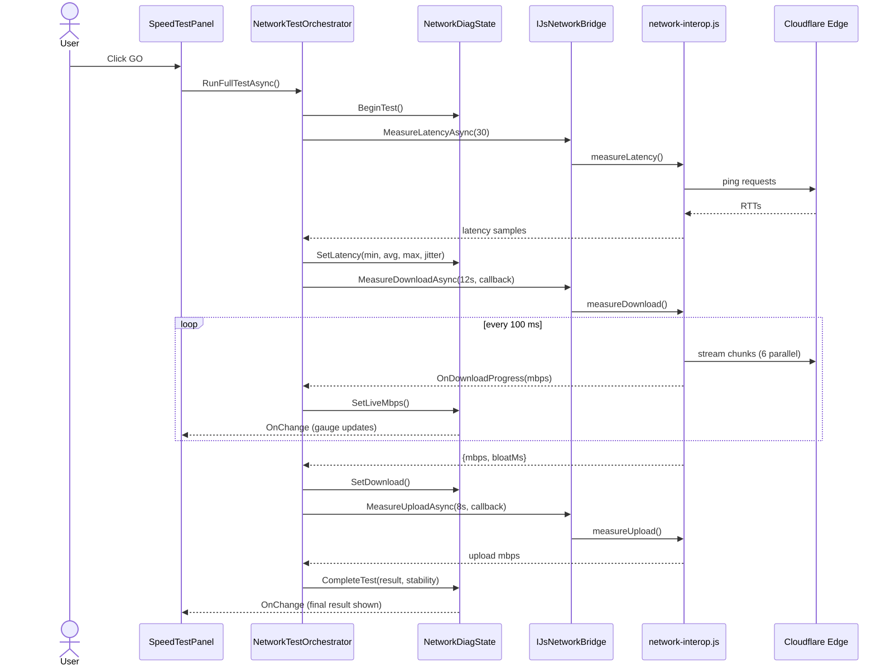
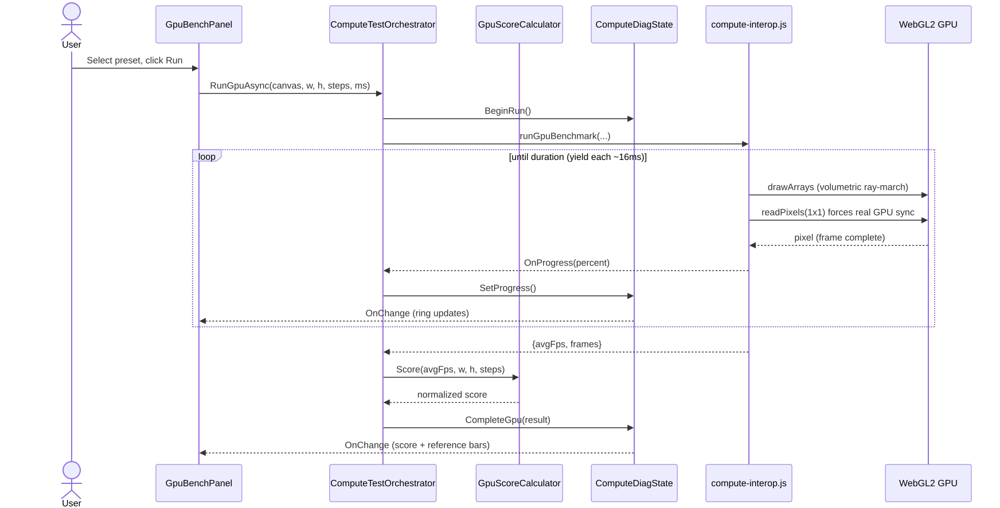
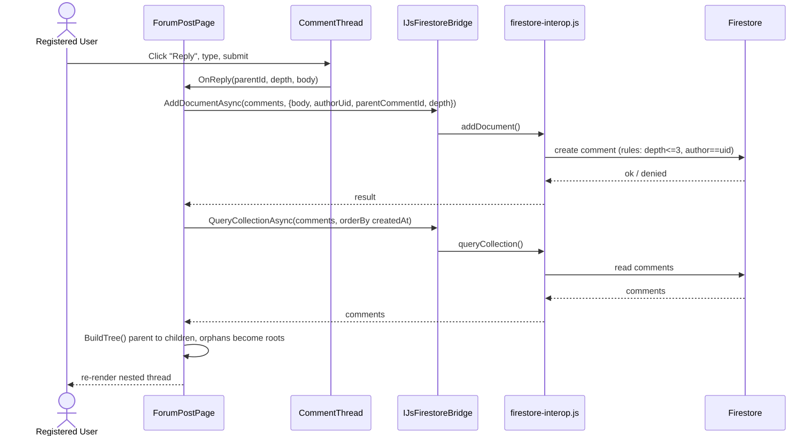
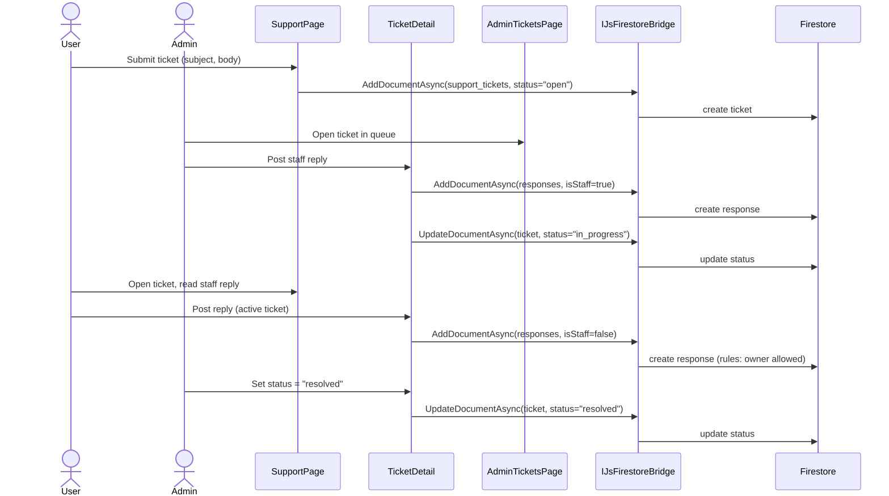
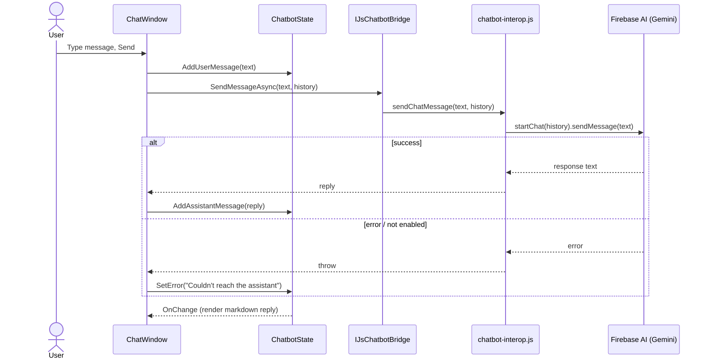
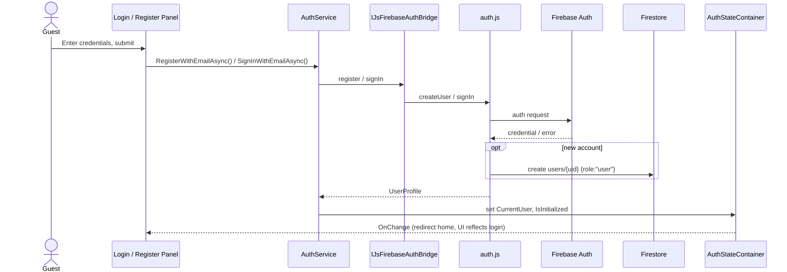

# BenchRig — Diagrams

Rendered **SVG** diagrams for the [design document](../../DESIGN.md). Each `*.svg` is generated from its
matching `*.mmd` (Mermaid) source, so the diagrams are version-controlled and reproducible. SVGs are
resolution-independent — open them in any browser, or import them into Word/PDF for submission.

| # | Diagram | Type | Source | Image |
|---|---------|------|--------|-------|
| 1 | Use Case | UML Use Case | [`use-case.mmd`](use-case.mmd) | [`use-case.svg`](use-case.svg) |
| 2 | Domain Model | UML (conceptual) | [`domain-model.mmd`](domain-model.mmd) | [`domain-model.svg`](domain-model.svg) |
| 3 | Class Diagram | UML (design) | [`class-diagram.mmd`](class-diagram.mmd) | [`class-diagram.svg`](class-diagram.svg) |
| 4 | ERD | Entity-Relationship | [`erd.mmd`](erd.mmd) | [`erd.svg`](erd.svg) |
| 5 | Sequence — Network Speed Test | UML Sequence | [`seq-network-speedtest.mmd`](seq-network-speedtest.mmd) | [`seq-network-speedtest.svg`](seq-network-speedtest.svg) |
| 6 | Sequence — GPU Benchmark | UML Sequence | [`seq-gpu-benchmark.mmd`](seq-gpu-benchmark.mmd) | [`seq-gpu-benchmark.svg`](seq-gpu-benchmark.svg) |
| 7 | Sequence — Forum Reply (threaded) | UML Sequence | [`seq-forum-reply.mmd`](seq-forum-reply.mmd) | [`seq-forum-reply.svg`](seq-forum-reply.svg) |
| 8 | Sequence — Ticket Lifecycle | UML Sequence | [`seq-ticket-lifecycle.mmd`](seq-ticket-lifecycle.mmd) | [`seq-ticket-lifecycle.svg`](seq-ticket-lifecycle.svg) |
| 9 | Sequence — AI Assistant | UML Sequence | [`seq-ai-chat.mmd`](seq-ai-chat.mmd) | [`seq-ai-chat.svg`](seq-ai-chat.svg) |
| 10 | Sequence — Register / Login | UML Sequence | [`seq-auth.mmd`](seq-auth.mmd) | [`seq-auth.svg`](seq-auth.svg) |

---

## 1. UML Use Case Diagram


## 2. UML Domain Model


## 3. UML Class Diagram


## 4. Entity-Relationship Diagram (Firestore data model)


## 5. Sequence — Run Network Speed Test


## 6. Sequence — Run GPU Benchmark (Volume Shader)


## 7. Sequence — Post a Threaded Forum Reply


## 8. Sequence — Support Ticket Lifecycle (User ⇄ Admin)


## 9. Sequence — AI Assistant Message


## 10. Sequence — Register / Login


---

## Regenerating the SVGs

The SVGs are produced from the `.mmd` sources with [`@mermaid-js/mermaid-cli`](https://github.com/mermaid-js/mermaid-cli).
`puppeteer-config.json` points Mermaid at a system Chrome so no extra Chromium download is required.

```powershell
# from this folder (docs/diagrams)
$env:PUPPETEER_SKIP_DOWNLOAD = "true"
foreach ($f in Get-ChildItem *.mmd) {
    npx -y @mermaid-js/mermaid-cli@11 -i $f.Name -o ([IO.Path]::ChangeExtension($f.Name,'svg')) -b white -p puppeteer-config.json
}
```

> Adjust `executablePath` in `puppeteer-config.json` to your local Chrome/Edge if it differs. You can also
> paste any `.mmd` into <https://mermaid.live> to render/export it directly.
